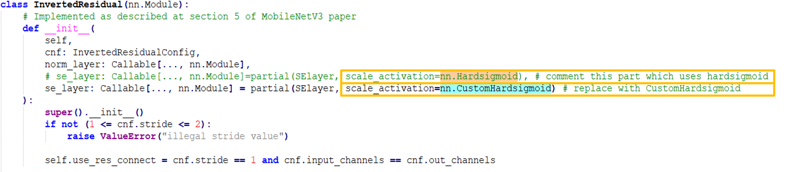
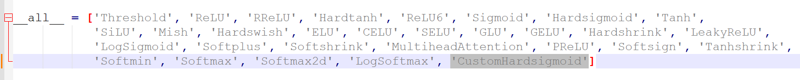
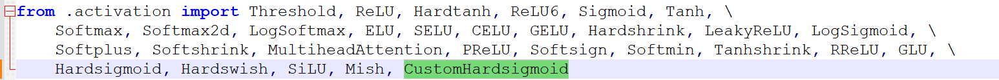
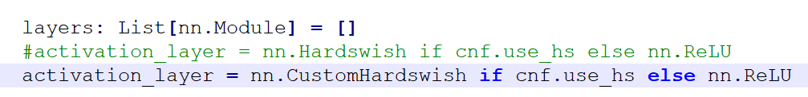
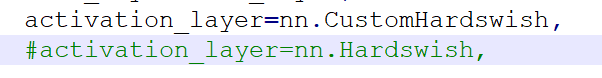
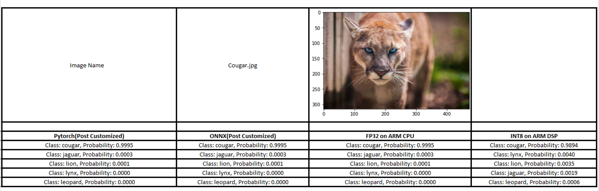

# Replacement Operator case study - Pytorch - MobilenetV3

## Procedure for Implementation of  Un-supported op HardSigmoid and HardSwish for PyTorch framework

Qualcomm® Neural Processing SDK offers a wide range of operations/layers from different ML frameworks like Caffe, ONNX, PyTorch and TensorFlow. For the operations which are not supported by the Qualcomm® Neural Processing SDK, We have provided a detailed step-by-step solution to provide the support for the layer's before converting the model to dlc using Qualcomm® Neural Processing SDK.


## Pre-Requisite

* Required SNPE-2.7.x
	* Qualcomm® Neural Processing SDK for AI setup should be completed by following the guide here: https://developer.qualcomm.com/sites/default/files/docs/snpe/setup.html
* python version 3.6.x and 3.8.x
* Torch version 1.10
* Install ```pip install jupyter```.
* Netron only if interested in Visualizing the TensorFlow frozen graph (Optional)
* Ubuntu 18.04.6 LTS
* Device used: Snapdragon® SM8550

## Model used 

* MobileNetV3 - Pytorch Model available in ```torchvision/models/mobilenetv3.py```

# Steps to generate dlc using Custom OP Implementation

**NOTE** : Qualcomm® Neural Processing SDK requires python version 3.6 and the model repo requires python 3.8 . Hence, It is advised to have two different virtual environment to work with.


## Steps to get the model 
1. Run the following command to get pretrained weights for the model -
 ```python
  cd generatedModels
  wget https://download.pytorch.org/models/mobilenet_v3_large-8738ca79.pth
 ```
2. Now , We will use the ```Pytorch``` model of ```MobileNetV3``` to get the ```ONNX``` model .We generally recommend this method for generating dlc from ```pytorch``` models, by converting to ```onnx``` and then to ```dlc``` . Run the ```getModel.py``` to generate the ```ONNX``` file - 
 ```python
  python getModel.py
  cd ..
 ``` 
 3. This will generate the ```ONNX``` model in the ```generatedModels/ONNX/``` folder.
 4. Now , We will focus on converting this model to ```dlc```.


## Model Conversion Error
1. **NOTE :** Please ensure that ```generatedModels/ONNX/mobilenet_v3.onnx``` file exists before proceeding further.
2. Check the model conversion to dlc using Qualcomm® Neural Processing SDK
   ```python
   snpe-onnx-to-dlc -i generatedModels/ONNX/mobilenet_v3.onnx -o generatedModels/ONNX/mobilenet_v3.dlc
   ```
   **Error :**
   .png)
 3. Here, we can see that 'onnx_hardsigmoid' translation is not registered, we will now focus on changing the implementation of hardsigmoid with our own custom harsigmoid implementation.
 
## Replacement of the layer - Harsigmoid
 
 1. Navigate to the model source file (where the model class have been defined). In this case, ```<python3.8-packages>/torchvision/models/mobilenetv3.py```.
 2. Search for the call/implementation of ```Hardsigmoid```.
    
 3. Comment the line and add your new line of code with the new ```customHardsigmoid``` call.
 4. As we can see that the ```Hardsigmoid``` was called from ```nn``` module as ```nn.Hardsigmoid```, hence, we will navigate to the ```<python3.8_path>/site-packages/torch/nn/``` dir to write our very own ```CustomHardsigmoid``` implementation.
 5. Now , the ```Hardsigmoid``` is an activation function. Hence, It is in the ```nn/modules/activation.py``` file.
 6. Now, in ```__all__``` variable add ```CustomHardsigmoid```` i.e., the name of your custom function to be defined.
    
 7. Now, Implement your own ```CustomHardsigmoid``` inside ```nn/modules/activation.py``` . **NOTE :** The SDK doesnot have a translation for ```nn.Hardsigmoid```. Hence, We will define the Hardsigmoid in such a way that it is SDK compatible. Hardsigmoid can be expressed as - 
 ```python
  torch.clamp((input*0.167+0.5),0,1)
 ```
 Please refer to the [code](class/CustomHardsigmoid.py) for the implementation of ```CustomHardsigmoid```
 8. Now that we have defined our own implementation, we shall now look for all the dependencies for ```nn.Hardsigmoid```.
 9. In the same ```torch/nn/modules/``` dir, add the ```CustomHarsigmoid``` call in the ```__init__.py``` file.
    
 **NOTE :** Save all your changes before proceeding.
 10. Navigate to your ```MobileNetV3``` directory and dump the model with the newly implemented ```Customhardsigmoid``` layer.
 ```python
   python generatedModels/getModel.py
 ```
 
## Error ONCE again!
 
 1. Convert the ```ONNX``` model with the newly implemented ```CustomHardsigmoid``` layer to ```dlc```
 ```python
   snpe-onnx-to-dlc -i generatedModels/ONNX/mobilenet_v3.onnx -o generatedModels/ONNX/mobilenet_v3.dlc
 ```
 **Error :** .png)
 
 2. We got a new layer error saying  'onnx_hardswish' translation is not registered, we will now focus on changing the implementation of hardswish with our own custom hardswish implementation.
 
## Replacement of the layer - Hardswish
   
 1. Navigate to the model source file (where the model class have been defined). In this case, ```<python3.8-packages>/torchvision/models/mobilenetv3.py```.
 2. Search for the call/implementation of ```Hardswish```.<br/>
   **Occurence-1**<br/>
    <br/>
   **Occurence-2**<br/> 
    <br/>
   **Occurence-3**<br/> 
    <br/>
   **Occurence-4**<br/> 
    <br/>
  
 3. Comment all these line and add your new line of code with the new ```CustomHardswish``` call.
 4. As we can see that the ```Hardswish``` was called from ```nn``` module as ```nn.Hardswish```, hence, we will navigate to the ```<python3.8_path>/site-packages/torch/nn/``` dir to write our very own ```CustomHardswish``` implementation.
 5. Now , the ```Hardswish``` is an activation function. Hence, It is in the ```nn/modules/activation.py``` file.
 6. Now, in ```__all__``` variable add ```CustomHardswish```` i.e., the name of your custom function to be defined.
    
 7. Now, Implement your own ```CustomHardswish``` inside ```nn/modules/activation.py```. **NOTE :** The SDK doesnot have a translation for ```nn.Hardswish```. Hence, We will define the Hardsigmoid in such a way that it is SDK compatible. Hardswish can be defined as a simplified expression -
 ```python 
  input*torch.clamp(input+3, min=0, max=6)/6
 ```
 8. Please refer to the [code](class/CustomHardswish.py) for the implementation of ```CustomHardswish```
 9. Now that we have defined our own implementation, we shall now look for all the dependencies for ```nn.Hardswish```.
 10. In the same ```torch/nn/modules/``` dir, add the ```CustomHarswish``` call in the ```__init.py``` file.
    
 **NOTE :** Save all your changes before proceeding.
 10. Navigate to your ```MobileNetV3``` directory and dump the model with the newly implemented ```Customhardswish``` layer.
 ```python
    python generatedModels/getModel.py
 ```
   
 ## Try Convert to dlc
 
  1. Convert the ```ONNX``` model with the newly implemented ```CustomHardswish``` alongwith ```CustomHardsigmoid``` layer to ```dlc```
  ```python
   snpe-onnx-to-dlc -i generatedModels/ONNX/mobilenet_v3.onnx -o generatedModels/ONNX/mobilenet_v3.dlc
  ```
  2. Now, we are able to convert the ```ONNX``` model to ```dlc``` using ```snpe-onnx-to-dlc```.<br/><br/>
     
     
 ## Further Steps
 
  1. Now that we have the ```dlc``` at hand, we can quantize the ```dlc``` as well do the ```Accuracy Analysis```. please refer to this [repo](/Models/MobileNetV3/)
  
  **Result :**
  
  
 
 ###### *Qualcomm Neural Processing SDK and Snapdragon are products of Qualcomm Technologies, Inc. and/or its subsidiaries.*    
