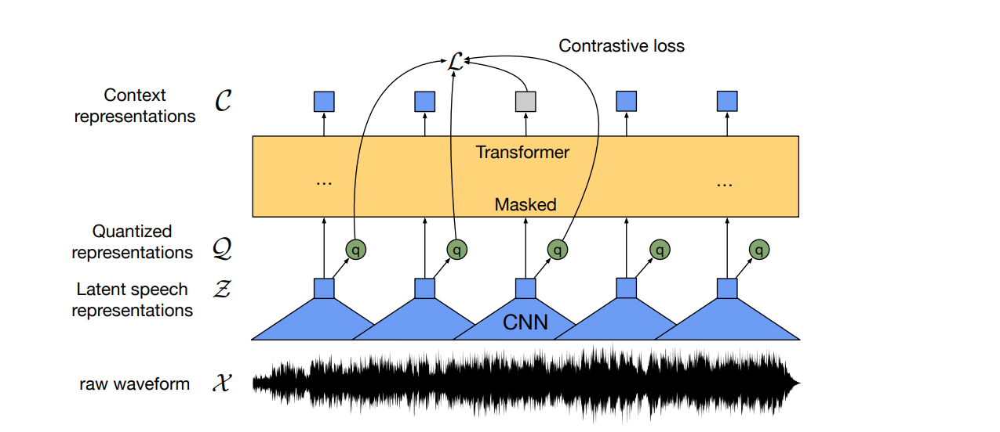

# "Automatic Speech Recognition" using Wav2Vec2


## Pre-Requisites

- Qualcomm® Neural Processing SDK setup should be completed by following the guide [here](https://developer.qualcomm.com/sites/default/files/docs/snpe/setup.html)
- Install onnx v1.6.0. Installation instruction can be found [here](https://qdn-drekartst.qualcomm.com/hardware/qualcomm-innovators-development-kit/frameworks-qualcomm-neural-processing-sdk-for-ai)
- Install onnxsim ```pip install onnxsim``` and onnxruntime ```pip install onnxruntime```.
- Install optimum ```pip install optimum```.


## Model Architecture
<p align="center">

</p>

## How to get the model ? 

For this demo, you can directly get the onnx model by running this command in linux machine
```
optimum-cli export onnx --model facebook/wav2vec2-base-960h models/
```


## Convert model to DLC 

- Convert the onnx model to DLC with below command. Below, command will also fix the input dimension for the dlc. 

```python
snpe-onnx-to-dlc -i model.onnx -d input_values 1,40000 -o wav2vec2_fp32.dlc 
```

## Quantization of DLC
- Quantization can improve model performance in terms of latency and make the model light weight. 
- Before Running this command make sure you've created the raw file and the list.txt
- Please change the htps socs(SM8650,SM8550) based on your preferences.
```python
snpe-dlc-quantize --input_dlc models/wav2vec2_fp32.dlc --input_list list.txt  --optimizations cle --output_dlc models/wav2vec2_w8a16.dlc --enable_htp --htp_socs sm8650 --weights_bitwidth 8 --act_bitwidth 16
```

# Accuracy analysis
- To check accuracy please run "accuracy_analyzer.ipynb" a jupyter notebook present in accuracy folder.
- To run any jupyter notebook, run below command. It will generate few links on the screen, pick the link with your machine name on it (host-name) and paste it in any browser.
- Navigate to the notebook ".ipynb" file and simply click that file.
```python
jupyter notebook --no-browser --port=8080 --ip 0.0.0.0 --allow-root
```


# References

1. https://arxiv.org/abs/2006.11477
2. https://huggingface.co/docs/transformers/model_doc/wav2vec2

    
###### *Qualcomm Neural Processing SDK and Snapdragon are products of Qualcomm Technologies, Inc. and/or its subsidiaries.*    
