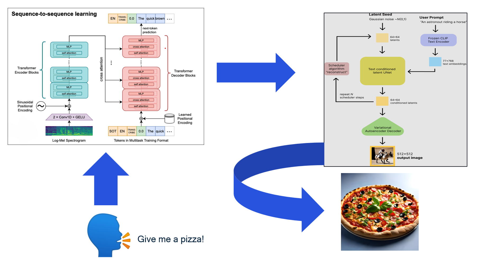

# Speech to image

This project involves an advanced chat application for Android devices powered by Snapdragon, utilizing the [QNN](https://docs.qualcomm.com/bundle/publicresource/topics/80-63442-50/introduction.html) interface. The application leverages sophisticated models from [AI Hub](https://aihub.qualcomm.com/) to generate highly detailed images based on either speech audio or text input provided by the user. This integration enables a seamless and interactive user experience, allowing for real-time image creation conditioned on the user's input.

<p align="center">

</p>


## Index
- [AI Models](#ai-models)
- [List of tested devices](#list-of-tested-devices)
- [Architecture](#architecture)
- [Prerequisites](#prerequisites)
- [Setup and Compilation Instructions](#setup-and-compilation-instructions)


## AI Models

In this project are used two AI models: 
- [Whisper](https://en.wikipedia.org/wiki/Whisper_(speech_recognition_system)) (Speech to text)
- [Stable diffusion](https://en.wikipedia.org/wiki/Stable_Diffusion) (Conditioned images generation)

## Architecture
Speech to Image is an Android application that leverages the QNN interface to run two AI models, enabling the generation of speech audio into a conditioned image output.

The application utilizes JNI to bridge C++ and Kotlin. The C++ component employs the QNN APIs to execute the models directly on the Snapdragon HTP, while the Kotlin side handles the UI, data management, and multithreaded execution.

The C++ application functions as an abstract API, which the Kotlin side uses seamlessly to manage the application's operations and ensure efficient performance.

The UI is inspired by the most popular LLM or image generation tools, functioning like a chat app between the user and the models.

<p align="center">

</p>

## List of tested devices
This application was tested on:
- Snapdragon 8 Elite

## Prerequisites
- Set up [Qualcomm® AI Engine Direct](https://www.qualcomm.com/developer/software/qualcomm-ai-engine-direct-sdk) from [this guide](https://docs.qualcomm.com/bundle/publicresource/topics/80-63442-50/setup.html)
    - Tested version: v2.40.0
```bash
export QNN_SDK_ROOT=<path to QAIRT SDK>
```	
- [Android NDK](https://developer.android.com/ndk)
    - Tested version: 27.2.12479018
- Rust
- Python 3.10

## Tools
- Download [Android Studio](https://developer.android.com/studio/archive). **App is tested with Version 2024.3.1.

## Setup and Compilation Instructions
### Compiling dependencies
To make the application work you must compile two rust libraries that are used by the application to work with inputs and outputs of the models.

Before compiling, you need to install rust and the dependencies:

```bash
curl --proto '=https' --tlsv1.2 -sSf https://sh.rustup.rs | sh
rustup target add aarch64-linux-android
cargo install cargo-ndk
```

Then to compile you have to go to the directory *tokenizer* and compile the library with:

```bash
cargo ndk -t arm64-v8a build --release
```

Then you have to do the same with the directory *detokenizer*.

```bash
cargo ndk -t arm64-v8a build --release
```

### Libraries to put in  *speech_to_image/app/src/main/jniLibs/arm64-v8a*:
- libc++_shared.so (from *android-ndk-r27c/toolchains/llvm/prebuilt/linux-x86_64/sysroot/usr/lib/aarch64-linux-android*)
- libtokenizer.so (compiled rust library, in *tokenizer/target/aarch64-linux-android/release*)
- libdetokenizer.so (compiled rust library, in *detokenizer/target/aarch64-linux-android/release*)
- libQnnHtpVXX.so (from *$QNN_SDK_ROOT/lib/hexagon-vXX/unsigned*)
- libQnnHtpVXXSkel.so (from *$QNN_SDK_ROOT/lib/hexagon-vXX/unsigned*)
- libQnnHtp.so (from *$QNN_SDK_ROOT/lib/aarch64-android*)
- libQnnHtpPrepare.so (from *$QNN_SDK_ROOT/lib/aarch64-android*)
- libQnnHtpVXXStub.so (from *$QNN_SDK_ROOT/lib/aarch64-android*)
- libQnnSystem.so (from *$QNN_SDK_ROOT/lib/aarch64-android*)

Change VXX with your version of hexagon, for example: V79 for Snapdragon 8 Elite

### qnn utilizes and their headers to put in  *speech_to_image/app/src/main/cpp/speech_to_image/src*:
```bash
source scritps/resolveDependencies.sh 
```


### Assets to put in *speech_to_image/app/src/main/assets*:
- tokenizer.json (from [Hugging face](https://huggingface.co/openai/clip-vit-base-patch32/blob/main/tokenizer.json))
- tokenizer.json (from [Hugging face](https://huggingface.co/openai/whisper-small/blob/main/tokenizer.json), rename it to *detokenizer.json*)
- text_encoder.bin (from [Qualcomm Package Manager](https://qpm.qualcomm.com/#/main/tools/details/Tutorial_for_Stable_Diffusion_2_1_Compute))
- unet.bin (from [Qualcomm Package Manager](https://qpm.qualcomm.com/#/main/tools/details/Tutorial_for_Stable_Diffusion_2_1_Compute))
- vae_decoder.bin (from [Qualcomm Package Manager](https://qpm.qualcomm.com/#/main/tools/details/Tutorial_for_Stable_Diffusion_2_1_Compute))
- whisper_encoder_tiny.bin (from [AI Hub Precompiled](https://huggingface.co/qualcomm/Whisper-Tiny/tree/c84e283908f77baaaeaca983b495d1179a9334a1/precompiled/qualcomm-snapdragon-8-elite-for-galaxy))
- whisper_decoder_tiny.bin (from [AI Hub Precompiled](https://huggingface.co/qualcomm/Whisper-Tiny/tree/c84e283908f77baaaeaca983b495d1179a9334a1/precompiled/qualcomm-snapdragon-8-elite-for-galaxy))
- mel80.bin (from [log_mel_spectrogram/assets](https://github.com/psmdv/log_mel_spectrogram/tree/main/assets))
- t_emb_0.raw, ..., t_emb19.raw (use the *python_scripts/generate_t_emb_and_empty_tokens.py* script)
- tokens.raw (use the *python_scripts/generate_t_emb_and_empty_tokens.py* script)

To generate Stable Diffusion binaries (text_encoder, unet, and vae_decoder), follow the tutorial steps: first optimize and export the PyTorch model using AIMET, then prepare and convert the ONNX model to Qualcomm NN format.

### Other dependencies
To make the application work you have to copy [log_mel_spectrogram.cpp](https://github.com/psmdv/log_mel_spectrogram/tree/main/src/log_mel_spectrogram.cpp) and [wavreader.cpp](https://github.com/psmdv/log_mel_spectrogram/tree/main/src/wavreader.cpp) in *speech_to_image\app\src\main\cpp\speech_to_image\src\LogMel\src*, aswell as their headers: [log_mal_spectrogram.hpp](https://github.com/psmdv/log_mel_spectrogram/blob/main/inc/log_mel_spectrogram.hpp) and [wavreader.h](https://github.com/psmdv/log_mel_spectrogram/blob/main/inc/wavreader.h) in *speech_to_image\app\src\main\cpp\speech_to_image\src\LogMel\include*

Also, you need to copy [stb_image_write.h](https://github.com/nothings/stb/blob/master/stb_image_write.h) to *speech_to_image\app\src\main\cpp\speech_to_image\src\Utils*

### Setting libraries on device
```bash
adb root
adb shell setenforce 0
adb disable-verity
adb shell mount -o rw,remount /vendor
adb push path-to-libQnnHtpVXXSkel.so /vendor/lib/rfsa/adsp/
```

After these steps, you should be able to run the app via Android Studio (2024.3.1) on device.
