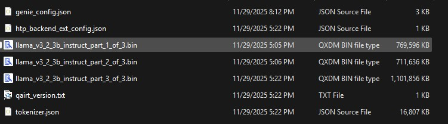

## AI Assistant powered by LLaMA GenAI
This AI-Assistant App acts like AI companion chat naturally, get instant answers, and simplify tasks and leverages cutting-edge GenAI based models like LLaMA. 
This app demonstrates how to use the Genie C++ APIs from [QAIRT SDK](https://qpm.qualcomm.com/#/main/tools/details/Qualcomm_AI_Runtime_SDK) to run and 
accelerate LLMs using the Snapdragon NPU.

## Requirements

### Platform

- QIDK Snapdragon® 8 Elite device

### Access Request

- Get access hugging face tokenization and request LLM model access like llama from Hugging Face
- Get access qualcomm AI Hub tokenization

### Tools and SDK

- Download [Android Studio](https://developer.android.com/studio/archive). **App is tested with Version 2024.3.1.


### Download LLM Model from AI HUB

- Follow steps in this [LLM On-Device Deployment] (https://github.com/quic/ai-hub-apps/tree/main/tutorials/llm_on_genie) to setting up a Python environment with Qualcomm AI Hub Models.

- Run export script to get context binaries for Llama variants.

	- Read more about [exporting LLMs via AI Hub here](https://github.com/quic/ai-hub-apps/tree/main/tutorials/llm_on_genie#step-2-export-qairt-compatible-llm-models-on-the-host-machine)

        - You'll have to replace model name from the above tutorial with `llama_v3_2_3b_instruct` or the model id of your choice and reduce context length for this demo when exporting.

		- Exporting Llama 3.2 models will take around 1-2 hours with good internet connectivity.
		
		- Files generated after successful execution of export command. genie_bundle folder contains following files.
		
		  
	
- Download and extract QAIRT SDK compatible with AI HUB based LLM model:

	We recommend using same QAIRT SDK (also "QNN SDK" for older versions) version as the one used by AI Hub for generating QNN context binaries.
	You can find the AI Hub QAIRT version in the compile job page as shown in the following screenshot or you can find QAIRT version from genie_bundle output fold contains qairt_version.txt:
	
	
	
	Having different QAIRT versions could result in runtime or load-time failures.
	
	Follow these steps to configure QAIRT SDKs for ChatApp
	
	Download and extract [Qualcomm® AI Runtime SDK](https://qpm.qualcomm.com/#/main/tools/details/Qualcomm_AI_Runtime_SDK) (see [QNN SDK](https://qpm.qualcomm.com/#/main/tools/details/qualcomm_ai_engine_direct) for older versions) for Linux.


## Build App

1. Go to AI-Assistant directory

	```bash
	cd <qidk path location>/Solutions/AI-Assistant/
	```

2. You need to take all the artifacts from here and copy it to **genie_bundle** as well as in this folder **GenAI\AI-Assistant\app\src\main\jniLibs\arm64-v8a**

	### Set QAIRT SDK Path
	```bash
	export QAIRT_SDK_ROOT=<path to QAIRT version recommended for AI Hub LLM model>
	```

	### For Snapdragon 8 Gen 3
	```
	cp $QAIRT_SDK_ROOT/lib/hexagon-v75/unsigned/* genie_bundle
	```

	### For Snapdragon 8 Elite
	```
	cp $QAIRT_SDK_ROOT/lib/hexagon-v79/unsigned/* genie_bundle
	```

	### For all devices
	```
	cp $QAIRT_SDK_ROOT/lib/aarch64-android/* genie_bundle
	cp $QAIRT_SDK_ROOT/bin/aarch64-android/genie-t2t-run genie_bundle
	```

3. Copy the json from genie_bundle to assets folder **GenAI\AI-Assistant\app\src\main\assets**
	```
	cp <path to exported genie_bundle>\genie_bundle\genie_config.json app\src\main\assets\<name according to llm model>.json
	cp <path to exported genie_bundle>\genie_bundle\htp_backend_ext_config.json app\src\main\assets\
	cp <path to exported genie_bundle>\genie_bundle\tokenizer.json app\src\main\assets\
	```

4. Now push all the artifacts to this folder   **./data/local/tmp/**
	```
	adb push .\genie_bundle\* /data/local/tmp/
	```

5. Use Android Studio to compile and install the application on the device.

## Execute LLM using genie-t2t-run

1. Copy all the binaries to device.
	```
	adb push .\genie_bundle\* /data/local/tmp/
	```
2. Goto the device teriminal shell.
	```
	adb shell
	```
3. Goto the binaries folder in device.
	```
	cd /data/local/tmp/
	```
4. Export the library path.
	```
	export LD_LIBRARY_PATH=/data/local/tmp/
	export ADSP_LIBRARY_PATH=/data/local/tmp/
	```
5. Run genie-t2t-run command
	```
	./genie-t2t-run -c llama_v3_2_3b_chat_quantized.json -p "<|begin_of_text|><|start_header_id|>user<|end_header_id|> Instruction: You are an AI assistant designed to help users with a wide range of tasks. Your primary goals are to provide accurate information, assist with various tasks, and engage in meaningful conversations. {Question}: what is Ai<|eot_id|><|start_header_id|>assistant<|end_header_id|>"
	```

	


## Demo - AI-Assistant App Usage
