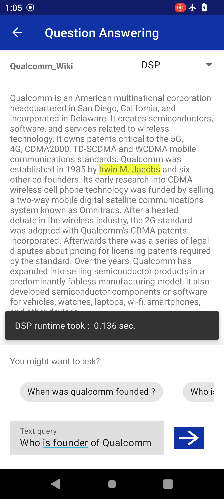
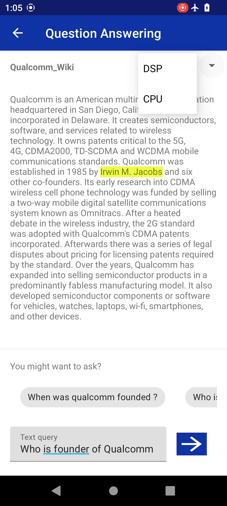

# OnDevice Question-Answering with Transformers

- [Introduction](#introduction)
- [Prerequisites](#prerequisites)
- [Quick Start](#quick-start)
  1. [Model Preparation](#1-model-preparation)
  2. [Model and DLC Validation](#2-model-and-dlc-validation)
  3. [Ondevice Profiling](#3-ondevice-performance-profiling)
  4. [Build and Run with Android Studio](#4-build-and-run-with-android-studio)
- [Qualcomm® Neural Processing SDK C++ APIs JNI Integration](#qualcomm-neural-processing-sdk-c-apis-jni-integration)
- [Credits](#credits)
- [References](#references)

## Introduction

Question Answering (QA) is one of the common and challenging Natural Language Processing tasks. <br>
- Current project is an sample Android application for OnDevice Question Ansering based on [ICLR 2020 Electra](https://openreview.net/pdf?id=r1xMH1BtvB) Transformer model acclerated using Qualcomm® Neural Processing SDK for AI framework.

- Model used in this project is : https://huggingface.co/mrm8488/electra-small-finetuned-squadv2 

- [Electra-small-discriminator](https://huggingface.co/google/electra-small-discriminator) is a small, efficient and mobile friendly Transformer model fine-tuned on [SQUAD v2.0 dataset](https://rajpurkar.github.io/SQuAD-explorer/explore/v2.0/dev/) for **Q&A** downstream task

- In this project, we'll show how to efficiently convert, deploy and acclerate [Electra-small](https://huggingface.co/mrm8488/electra-small-finetuned-squadv2) model on Snapdragon® platforms to perform Ondevice Question Answering.

<p align="center">

</p>

## Prerequisites
* Android Studio to import and build the project

* [Qualcomm® Neural Processing Engine for AI SDK] v2.x.x and its [dependencies](https://docs.qualcomm.com/bundle/publicresource/topics/80-63442-2/setup.html?product=1601111740010412) to integrate and accelerate the network on Snapdragon<br>
  

## Quick Start

### 1. Model Preparation

#### 1.1 Generate Electra-small model as Tensorflow Frozen Graph:

```
python scripts/qa_model_gen.py
```
Model will get generated at `./frozen_models` directory with name `electra_small_squad2.pb` having input Sequence_Length = `384` <br>
<br>
#### 1.2 Setup the Qualcomm® Neural Processing SDK Environment:
```
source <snpe-sdk-location>/bin/envsetup.sh -t $TENSORFLOW_DIR
```

#### 1.3 Convert generated frozen graph into DLC (Deep Learning Container):
```
snpe-tensorflow-to-dlc -i frozen_models/electra_small_squad2.pb -d input_ids 1,384 -d attention_mask 1,384 -d token_type_ids 1,384 --out_node Identity --out_node Identity_1 -o frozen_models/electra_small_squad2.dlc
```
where "input_ids, attention_mask, token_type_ids" are input of the model and "Identity, Identity_1" are its output.<br><br>
This command converts Tensorflow frozen graph into DLC format, which DSP, GPU And CPU accelerators can understand for running inference. DLC will get saved at "frozen_models" directory with name `electra_small_squad2.dlc`. <br>

###### <i>(If you are using a different Tensorflow version to generate PB file, it may be a case that Output Layer names gets changed. Please check once by visualizing graph using Netron viewer or any other visualization tools )</i> <br>


#### 1.4 Offline Preparation (caching) of DLC (for optimizing model loading time on DSP accelerator)
```
snpe-dlc-graph-prepare --input_dlc frozen_models/electra_small_squad2.dlc --use_float_io --htp_archs v79 --set_output_tensors Identity:0,Identity_1:0
```
A new DLC will get saved at `frozen_models` directory with name `electra_small_squad2_cached.dlc`. <br>

<br>

If you want to skip the following <b><i>optional</i></b> Section 2 and 3 for accuracy and performance profiling then,
#### Please jump to section [4. Build and Run with Android Studio](#4-build-and-run-with-android-studio) 

<br>

### 2. Model and DLC Validation

#### 2.1 Create "validation_set" directory and execute the following scripts:
```
mkdir -p validation_set
cd validation_set/
python ../scripts/generate_representative_dataset_squadv2.py mrm8488/electra-small-finetuned-squadv2 50 384
```
This script saves 50 samples from SQUAD-v2 validation dataset with Golden Answers, where each input has sequence length of 384. <br>
###### <i>(If you face "UnicodeEncodeError" with 'print' statement inside docker container or on terminal, </i>
```
import sys, io
sys.stdout = io.TextIOWrapper(sys.stdout.buffer, encoding='utf-8')
```
###### <i>then add/uncomment above snippet in python script.)</i>
<br>

```
python ../scripts/gen_raw_list.py 50
``` 
This script generates two text files `tf_raw_list.txt` and `snpe_raw_list.txt` containing location of input files, that will be helpful for running inference.

#### 2.2 Validating generated Electra-small TF Frozen graph:
```
python ../scripts/batch_tf_inf.py ../frozen_models/electra_small_squad2.pb tf_raw_list.txt input_ids:0,attention_mask:0,token_type_ids:0 Identity:0,Identity_1:0
```
This script runs inference on "electra_small_squad2.pb" and stores results at `tf_out` directory. Please run this inference script from `validation_set` directory only, as tf_raw_list.txt contains relative path.

```
python ../scripts/logits_to_F1_score.py --model_name mrm8488/electra-small-finetuned-squadv2 --sequence_len 384 --logits_dir tf_out --golden_answers_dir golden_answers --top_k 1
```
This script evaluates model outputs and generate F1 and EM(Exact Match score). The output will be like :
```
Metrics report
===============================================================
exact = 68.0
f1 = 71.33333333333334
total = 50
HasAns_exact = 71.42857142857143
HasAns_f1 = 77.38095238095238
HasAns_total = 28
NoAns_exact = 63.63636363636363
NoAns_f1 = 63.63636363636363
NoAns_total = 22
best_exact = 68.0
best_exact_thresh = 0.0
best_f1 = 71.33333333333333
best_f1_thresh = 0.0
```
##### Note: This is a result on 50 samples from SQUAD-V2 dataset generated using "generate_representative_dataset_squadv2.py" script
<br>

#### 2.3 Validating generated Electra-small DLC on DSP runtime:
```
 python $SNPE_ROOT/benchmarks/SNPE/snpe_bench.py -c dsp_accuracy_test.json -t android-aarch64 -p burst -z
```
This command will push DLC, SDK assets and Input artifacts on connected device and auto-run inference on DSP runtime.
```
adb pull /data/local/tmp/8550snpeQA/dOut/output snpe_dsp_out
```
This command will pull all inference outputs in `snpe_dsp_out` directory.
```
tree snpe_dsp_out
```
The directory structure will be like :<br>
<i>snpe_dsp_out/Result_0/Identity:0.raw</i><br>
<i>snpe_dsp_out/Result_0/Identity_1:0.raw</i><br>
<i>snpe_dsp_out/Result_1/Identity:0.raw</i><br>
<i>snpe_dsp_out/Result_1/Identity_1:0.raw</i><br>
<i>...</i>
<br>

```
python ../scripts/logits_to_F1_score.py --model_name mrm8488/electra-small-finetuned-squadv2 --sequence_len 384 --logits_dir snpe_dsp_out --golden_answers_dir golden_answers --top_k 1
```
This script evaluates model outputs and generate F1 and EM(Exact Match) score. The output will be same as TF Frozen graph as mentioned above:

```
Metrics report
===============================================================
exact = 68.0
f1 = 71.33333333333334
total = 50
```

### 3. OnDevice Performance Profiling:
```
 python $SNPE_ROOT/benchmarks/snpe_bench.py -c ondevice_perf_test.json -t android-aarch64 -p burst -z
```
This command will push DLC, SDK assets and Input artifacts on connected device and auto-run inference on DSP, GPU_FP16 and CPU runtimes.<br>
On-completion, benchmarking results will be stored at : `dOut/results/latest_results/benchmark_stats_dOut.csv`
Please refer to "Total Inference Time" field in CSV file, which shows Model execution time <i>(in microseconds (us))</i><br>

#### <u>PERF RESULTS</u> (<i>Lower is better</i>):

|                     | DSP_FP16    | GPU_FP16    | CPU_FP32    |
| :---:               | :---:       | :---:       | :---:       |
| Inference time (ms) | 99.302 ms   | 574.111 ms  | 885.543 ms  |

##### Note: Performance may change based on SDK version and device meta build.

To understand benchmark fields in CSV file please refer to "CSV Benchmark Results File" section : https://docs.qualcomm.com/bundle/publicresource/topics/80-63442-2/benchmarking.html?product=1601111740010412 <br>


### 4. Build and run with Android Studio

#### Add AI SDK libs and generated DLC into app assets, jniLibs and cmakeLibs directory:
Make sure `SNPE_ROOT` env variable is set
```
./scripts/fetch_snpe_assets.sh
```

#### Open the `QuestionAnswering` directory in Android Studio and build the project
On opening the project, the Android Studio may ask you to download Android NDK which is needed for building the AI SDK C++ Native APIs.
On sucessfull completion of project sync and build process, press the play icon to install and run the app on connected device.

* If build process fails with `libSNPE.so` duplication error, then please change its path from "jniLibs" to "cmakeLibs" as follows : `${CMAKE_CURRENT_SOURCE_DIR}/../cmakeLibs/arm64-v8a/libSNPE.so` in `QuestionAnswering/bert/src/main/cpp/CMakeList.txt` under `target_link_libraries` section and delete `libSnpe.so` from "jniLibs" directory.

#### Manual APK Installation
If Android Studio is not able to detect the device or if device is in remote location and copy the APK to current directory:
```
cp ./QuestionAnswering/app/build/outputs/apk/debug/app-debug.apk ./qa-app.apk
```
```
adb install -r -t qa-app.apk
```

#### Debug Tips
* After installing the application, if it is crashing, try to collect the logs from QIDK device.
* To collect logs run the below commands.
	*	adb logcat -c
	* 	adb logcat > log.txt
	*	Now, run the app. Once, the app has crashed do Ctrl+C to terminate log collection.
	*	log.txt will be generated in current folder.
	*	Search for the keyword "crash" to analyze the error.

* On opening the app, if Unsigned or Signed DSP runtime is not getting detected, then please search the logcat logs with keywork `dsp` for the FastRPC errors.
* DSP runtime may not get detected due to SE Linux security policy in some Android builds. Please try out following commands to set `permissive` SE Linux policy.
```
adb disable-verity
adb reboot
adb root
adb remount
adb shell setenforce 0
// launch the application
```		

#### QA App Workflow 
Following is the basic Question Answering Android App.
* Select any Article from list of Articles on App Home screen
*	On Article selection instantiate SDK Network
*	Select desired runtime from drop down (for example, DSP, GPU, CPU)
*	Ask a Question and prepare input data for the model (input_ids, attention_mask, token_type_ids)
*	Execute the SDK Network
*	Post-process inference output and highlight Top1 answer in the Article

<p align="center">




</p>


## Qualcomm® Neural Processing SDK C++ APIs JNI Integration

Please refer to SDK Native application tutorial : https://docs.qualcomm.com/bundle/publicresource/topics/80-63442-2/cplus_plus_tutorial.html?product=1601111740010412

## Credits

The pre-trained model is from HuggingFace Repository by MRM8488 (https://huggingface.co/mrm8488/electra-small-finetuned-squadv2)

The app is forked from https://github.com/huggingface/tflite-android-transformers repository and uses the same
tokenizer with Electra-small model.

## References

- https://github.com/tensorflow/examples
- https://openreview.net/pdf?id=r1xMH1BtvB
- https://rajpurkar.github.io/SQuAD-explorer/explore/v2.0/dev/
- https://github.com/huggingface/tflite-android-transformers
- https://huggingface.co/google/electra-small-discriminator
- https://huggingface.co/mrm8488/electra-small-finetuned-squadv2
- https://docs.qualcomm.com/bundle/publicresource/topics/80-63442-2/introduction.html?product=1601111740010412
- https://docs.qualcomm.com/bundle/publicresource/topics/80-63442-2/setup.html?product=1601111740010412
- https://docs.qualcomm.com/bundle/publicresource/topics/80-63442-2/usergroup10.html?product=1601111740010412
- https://docs.qualcomm.com/bundle/publicresource/topics/80-63442-2/usergroup8.html?product=1601111740010412


###### *Qualcomm Neural Processing SDK is a product of Qualcomm Technologies, Inc. and/or its subsidiaries.*
