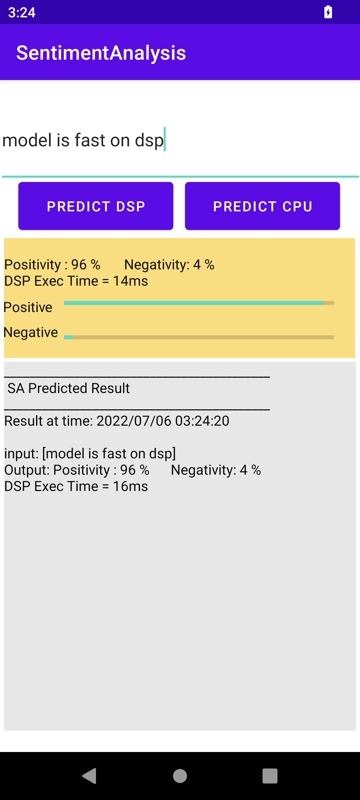
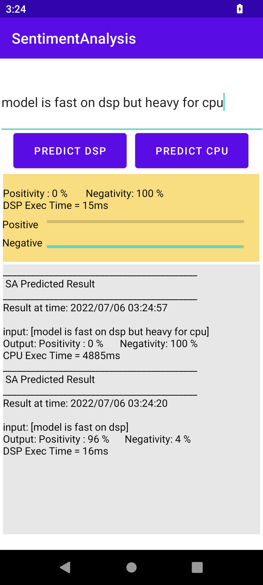

# OnDevice Sentiment-Analysis with Transformers

- [Introduction](#introduction)
- [Prerequisites](#prerequisites)
- [Quick Start](#quick-start)
  1. [Model Preparation](#1-model-preparation)
  2. [Model and DLC Validation](#2-model-and-dlc-validation)
  3. [Ondevice Profiling](#3-ondevice-performance-profiling)
  4. [Build and Run with Android Studio](#4-build-and-run-with-android-studio)
- [Qualcomm® Neural Processing SDK C++ APIs JNI Integration](#qualcomm-neural-processing-sdk-c-apis-jni-integration)
- [Credits](#credits)
- [References](#references)


<p align="center">

</p>


## Introduction

Sentiment Analysis(SA) is a [natural language processing](https://en.wikipedia.org/wiki/Natural_language_processing) technique that identifies the polarity of a given text, such as positive, negative. <br>
- Current project is an sample Android application for OnDevice Sentiment Analysis based on [ACL 2020 MobileBERT](https://arxiv.org/abs/2004.02984) Transformer model finetuned on [GLUE( General Language Understanding Evaluation) SST2 (Stanford Sentiment Treebank) dataset](https://gluebenchmark.com/) accelerated using Qualcomm® Neural Processing SDK for AI framework.

- Model used in this project is : https://huggingface.co/Alireza1044/mobilebert_sst2 

- [MobileBERT](https://arxiv.org/abs/2004.02984) is a thin version of BERT_LARGE, while equipped with bottleneck structures and a carefully designed balance between self-attentions and feed-forward networks.

- In this project, we'll show how to efficiently convert, deploy and acclerate [MobileBERT-SST2](https://huggingface.co/Alireza1044/mobilebert_sst2) model on Snapdragon to perform Ondevice Sentiment Analysis.

## Prerequisites
* Android Studio to import and build the project
* Python 3.6, PyTorch 1.10.1, Tensorflow 2.6.2, Transformers 4.18.0, Datasets 2.4.0 to prepare and validate the model<br>

* Qualcomm® Neural Processing Engine for AI SDK v2.x.x and its [dependencies](https://docs.qualcomm.com/bundle/publicresource/topics/80-63442-2/setup.html?product=1601111740010412) to integrate and accelerate the network on Snapdragon<br>
 

## Quick Start

### 1. Model Preparation

#### 1.1 Generate MobileBERT-SST2 model as Tensorflow Frozen Graph:

```
python scripts/sa_model_gen.py
```
Model will get generated at `./frozen_models` directory with name `mobilebert_sst2.pb` having Input Sequence_Length = `128` <br>
<br>

#### 1.2 Setup the Qualcomm® Neural Processing SDK Environment:
```
source <snpe-sdk-location>/bin/envsetup.sh -t $TENSORFLOW_DIR
```

#### 1.3 Convert generated frozen graph into DLC (Deep Learning Container):
```
snpe-tensorflow-to-dlc -i frozen_models/mobilebert_sst2.pb -d input_ids 1,128 -d attention_mask 1,128 --out_node Identity -o frozen_models/mobilebert_sst2.dlc
```
where "input_ids, attention_mask" are inputs of the model and "Identity" is its output.<br><br>
This command converts Tensorflow frozen graph into DLC format, which DSP, GPU And CPU accelerator can understand for running inference. DLC will get saved at "frozen_models" directory with name `mobilebert_sst2.dlc`. <br>

###### <i>(If you are using a different Tensorflow version to generate PB file, it may be a case that Output Layer names gets changed. Please check the output layer names once by visualizing graph using Netron viewer or any other visualization tools )</i> <br>

#### 1.4 Offline Preparation (caching) of DLC (for optimizing model loading/INIT time on DSP accelerator)
```
snpe-dlc-graph-prepare --input_dlc frozen_models/mobilebert_sst2.dlc --use_float_io --htp_archs v79
```
A new DLC will get save at `frozen_models` directory with name `mobilebert_sst2_cached.dlc`. <br>

<br>

If you want to skip the following <b><i>optional</i></b> Section 2 and 3 for accuracy and performance profiling then,
#### Please jump to section [4. Build and Run with Android Studio](#4-build-and-run-with-android-studio) 

<br>

### 2. Model and DLC Validation

#### 2.1 Create "validation_set" directory and execute the following scripts:
```
mkdir -p validation_set
cd validation_set/
python ../scripts/sst2_gen_dataset.py
```
This script saves 871 samples from SST2 validation dataset with Golden Answers, where each input has sequence length of 128

```
python ../scripts/gen_raw_list.py 871
``` 
This script generates two text files `tf_raw_list.txt` and `snpe_raw_list.txt` containing location of input files, that will be helpful for running inference.

#### 2.2 Validating generated MobileBert-SST2 TF Frozen graph:
```
Usage : python batch_tf_inf.py <Frozen_pb_file_name> <Input_raw_img_list.txt> <Input_layer_name> <Output_layer_name>

python ../scripts/batch_tf_inf.py ../frozen_models/mobilebert_sst2.pb tf_raw_list.txt input_ids:0,attention_mask:0 Identity:0
```
This script runs inference on "mobilebert_sst2.pb" and stores results at `tf_out` directory. Please run this inference script from `validation_set` directory only, as tf_raw_list.txt contains relative path.

```
 Usage : python qc_verify_accuracy_pred.py <K-samples> <tf | snpe> <logits_dir>
 
 python ../scripts/get_accuracy_score.py 871 tf tf_out
```
This script evaluates model outputs and generate F1 and EM(Exact Match score). The output will be like :
```
Accuracy = 90.35591274397244 %
```
##### Note: This is a result on 871 samples from SQUAD-V2 dataset generated using "generate_representative_dataset_squadv2.py" script
<br>

#### 2.3 Validating generated MobileBERT-SST2 DLC on DSP runtime:
Before using dsp_accuracy_test.json kindly change "Devices" value as per your QIDK. The same can be found by running "adb devices" on your linux machine after connecting QIDK to it.
```
 python $SNPE_ROOT/benchmarks/snpe_bench.py -c dsp_accuracy_test.json -t android-aarch64 -p burst -z
```
This command will push DLC, SDK assets and Input artifacts on connected device and auto-run inference on DSP runtime.
```
adb pull /data/local/tmp/8550snpeSA/dOut/output snpe_dsp_out
```
This command will pull all inference outputs in `snpe_dsp_out` directory
```
tree snpe_dsp_out
```
This command will pull all inference outputs in `snpe_dsp_out` directory.
The directory structure will be like :<br>
<i>snpe_dsp_out/Result_0/Identity:0.raw</i><br>
<i>snpe_dsp_out/Result_1/Identity:0.raw</i><br>
<i>...</i>
<br>

```
Usage : python qc_verify_accuracy_pred.py <K-samples> <tf | snpe> <logits_dir>

python ../scripts/get_accuracy_score.py 871 snpe snpe_dsp_out
```
This script evaluates model outputs and generates accuracy score. The output will be same as TF Frozen graph as mentioned above:

```
Accuracy = 90.35591274397244 %
```

### 3. OnDevice Performance Profiling:
Before using ondevice_perf_test.json kindly change "Devices" value as per your QIDK. The same can be found by running "adb devices" on your linux machine after connecting QIDK to it.
```
 python $SNPE_ROOT/benchmarks/snpe_bench.py -c ondevice_perf_test.json -t android-aarch64 -p burst -z
```
This command will push DLC, SDK assets and Input artifacts on connected device and auto-run inference on DSP, GPU_FP16 and CPU runtimes.<br>
On-completion, benchmarking results will be stored at : `dOut/results/latest_results/benchmark_stats_dOut.csv`<br>
Please refer to "Total Inference Time" field in CSV file, which shows Model execution time <i>(in microseconds (us))</i><br>

#### <u>PERF RESULTS</u> (<i>Lower is better</i>):

|                     | DSP_FP16    |  CPU_FP32    |
| :---:               | :---:       |  :---:       |
| Inference time (ms) | 13.944 ms   |  207.361 ms  |

##### Note: Performance may change based on SDK version and device meta build.

To understand benchmark fields in CSV file please refer to "CSV Benchmark Results File" section : https://docs.qualcomm.com/bundle/publicresource/topics/80-63442-2/benchmarking.html?product=1601111740010412 <br>

### 4. Build and run with Android Studio

#### Add AI SDK libs and generated DLC into app assets, jniLibs and cmakeLibs directory:
Make sure `SNPE_ROOT` env variable is set
```
./scripts/fetch_snpe_assets.sh
```

#### Open the `SentimentAnalysis` directory in Android Studio and build the project
On opening the project, the Android Studio may ask you to download Android NDK which is needed for building the AI SDK C++ Native APIs.
On sucessfull completion of project sync and build process, press the play icon to install and run the app on connected device.

* If build process fails with `libSNPE.so` duplication error, then please change its path from "jniLibs" to "cmakeLibs" as follows : `${CMAKE_CURRENT_SOURCE_DIR}/../cmakeLibs/arm64-v8a/libSNPE.so` in `SentimentAnalysis/app/src/main/cpp/CMakeList.txt` under `target_link_libraries` section and delete `libSnpe.so` from "jniLibs" directory.

#### Manual APK Installation
If Android Studio is not able to detect the device or if device is in remote location and copy the APK to current directory:
```
cp ./SentimentAnalysis/app/build/outputs/apk/debug/app-debug.apk ./sa-app.apk
``` 
```
adb install -r -t sa-app.apk
```

#### Debug Tips
* After installing the application, if it is crashing, try to collect the logs from QIDK device.
* To collect logs run the below commands.
	*	adb logcat -c
	* 	adb logcat > log.txt
	*	Now, run the app. Once, the app has crashed do Ctrl+C to terminate log collection.
	*	log.txt will be generated in current folder.
	*	Search for the keyword "crash" to analyze the error.

* On opening the app, if Unsigned or Signed DSP runtime is not getting detected, then please search the logcat logs with keywork `dsp` for the FastRPC errors.
* DSP runtime may not get detected due to SE Linux security policy in some Android builds. Please try out following commands to set `permissive` SE Linux policy.
```
adb disable-verity
adb reboot
adb root
adb remount
adb shell setenforce 0
// launch the application
```		

#### SA App Workflow 
Following is the basic Question Answering Android App.
*	Select desired runtime from drop down (for example, DSP, GPU, CPU)
*   Type a sentence in textbox
*	For each letter typed, call SDK Execute method for running inference
*	Post-process inference output and update Postive-Negative sentiment field in UI

#### Some example results are:

<p align="center">




</p>
  
## Qualcomm® Neural Processing SDK C++ APIs JNI Integration

Please refer to SDK Native application tutorial : https://docs.qualcomm.com/bundle/publicresource/topics/80-63442-2/usergroup8.html?product=1601111740010412

## Credits

The pre-trained model is from HuggingFace Repository by Alireza1044 (https://huggingface.co/Alireza1044/mobilebert_sst2) <br>
The tokenizer src code is from https://github.com/huggingface/tflite-android-transformers/tree/master/bert/src/main/java/co/huggingface/android_transformers/bertqa/tokenization

## References

- https://arxiv.org/abs/2004.02984
- https://huggingface.co/Alireza1044/mobilebert_sst2
- https://docs.qualcomm.com/bundle/publicresource/topics/80-63442-2/introduction.html?product=1601111740010412
- https://docs.qualcomm.com/bundle/publicresource/topics/80-63442-2/setup.html?product=1601111740010412
- https://docs.qualcomm.com/bundle/publicresource/topics/80-63442-2/usergroup10.html?product=1601111740010412
- https://docs.qualcomm.com/bundle/publicresource/topics/80-63442-2/usergroup8.html?product=1601111740010412


###### *Qualcomm Neural Processing SDK is a product of Qualcomm Technologies, Inc. and/or its subsidiaries.*
