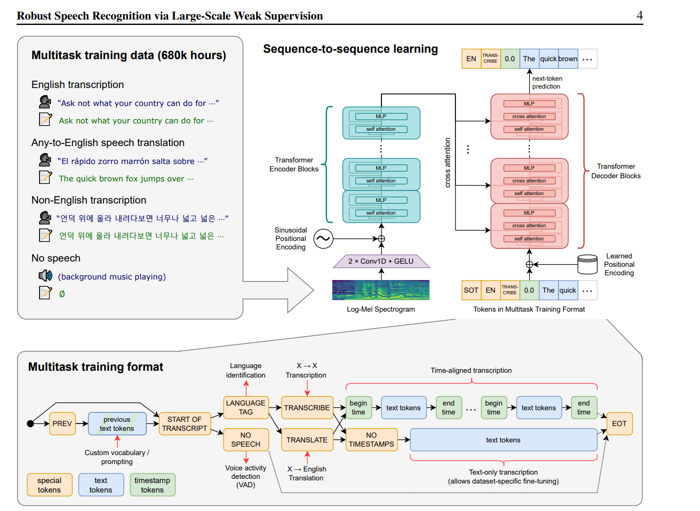

# OnDevice Automatic Speech Recognition

- [Introduction](#introduction)
- [Prerequisites](#prerequisites)
- [Quick Start](#quick-start)
- [Model Selection and DLC conversion](#1-model-preparation)
  1. Model Overview
  2. Steps to convert model to DLC
 
- [Build and Run with Android Studio](#4-build-and-run-with-android-studio)
  1. Source Organization
  2. Code implementataion
- [Qualcomm® Neural Processing SDK C++ APIs JNI Integration](#qualcomm-neural-processing-sdk-c-apis-jni-integration)
- [Reults](#Result)
- [Credits](#credits)
- [References](#references)

# Introduction

Automatic Speech Recognition (ASR) is one of the common and challenging Natural Language Processing tasks. <br>
- Current project is an sample Android application for OnDevice Automatic Speech Recognition using <b>Qualcomm® Neural Processing SDK for AI</b> framework. 
-  We have used [Whisper](https://github.com/openai/whisper) Model in this Solution

- This Solution has 2 Model, Encoder and Decoder Model.
- Encoder(Quantized-a16w8) part is taking fixed size input of shape (1,80,3000) and running on Snapdragon DSP processor.
- Decoder(Fp32) part is taking variable size input and running as TFLite model.
- Model is small, efficient and mobile friendly Transformer model fine-tuned on [librispeech dataset](https://www.tensorflow.org/datasets/catalog/librispeech) for **ASR** downstream task
- In this project, we'll show how to efficiently convert, deploy and acclerate of these model on Snapdragon® platforms to perform Ondevice Automatic Speech Recognition(ASR).

## Model Architecture
<p align="center">

</p>

## Prerequisites
* Android Studio to import and build the project
* Set up for <b>Qualcomm® Neural Processing SDK for AI</b> 
  
## Quick Start

### 1. Model Preparation
Please go to Generate_Assets/Whisper_Notebook.ipynb file to generate the model and check the sample output,pipeline,**Before running this Notebook Setup your SNPE Environment from the below code.**
<br>
#### 1.2 Setup the Qualcomm® Neural Processing SDK Environment:
```
source <snpe-sdk-location>/bin/envsetup.sh 
```


#### 1.3 Convert pytorch model to ONNX (Deep Learning Container):
```
tiny_model = whisper.load_model("tiny")

#Export to onnx format
torch.onnx.export(tiny_model.encoder,torch.randn(1,80,3000).to(device), "./whisper_encoder.onnx",opset_version=14)
```
#### 1.4 Convert ONNX model to DLC(Deep Learning Container):
```
snpe-onnx-to-dlc -i whisper_encoder.onnx -d x.1 1,80,3000 -o whisper_tiny_encoder_fp32.dlc
```

###### <i>(you can add outputTensor name in the above command, please check SNPE Document for more information. Please check once by visualizing graph using Netron viewer or any other visualization tools )</i> <br>


#### 1.4 Quantization with caching of DLC (for optimizing model loading time on DSP accelerator)
```
snpe-dlc-quantize --input_dlc whisper_tiny_encoder_fp32.dlc --input_list list.txt  --optimizations cle --axis_quant --output_dlc whisper_tiny_encoder_w8a16.dlc --weights_bitwidth 8 --act_bitwidth 16 --enable_htp --htp_socs sm8650

```
#### 1.5 Getting the Decoder TFLite Model
[Decoder-TFLIte Model](https://github.com/usefulsensors/openai-whisper/tree/main/models), Please use 'whisper-decoder-tiny.tflite' from this link.

 <br>

## Build and run with Android Studio

#### Add AI SDK libs and generated DLC into app assets, jniLibs and cmakeLibs directory:
1. Create "zdl" directory to store all the SNPE header files in andorid app include path Android_App_Whisper/app/src/main/cpp/inc/
```java
mkdir -p Android_App_Whisper/app/src/main/cpp/inc/zdl
```
2. Copy all SNPE header files from location $SNPE_ROOT/include/SNPE/* to ./Android_App_Whisper/app/src/main/cpp/inc/zdl/
```java
cp -r $SNPE_ROOT/include/SNPE/* ./Android_App_Whisper/app/src/main/cpp/inc/zdl/
```
3.  Take $SNPE_ROOT/lib/android/snpe-release.aar file, unzip it
```java
mkdir snpe-release
cp $SNPE_ROOT/lib/android/snpe-release.aar snpe-release
cd snpe-release
unzip snpe-release.aar
cd ../
```
4. Then create **app/src/main/jniLibs** folder and paste everything from **jni/arm64-v8a** which is extracted from **snpe-release.aar** to this **app/src/main/jniLibs/arm64-v8a** folder.
```java
mkdir -p ./Android_App_Whisper/app/src/main/jniLibs
cp -R snpe-release/jni/arm64-v8a Android_App_Whisper/app/src/main/jniLibs/
```

5. Create assets folder and copy the generated dlc files to the assets folder.
```java
mkdir -p Android_App_Whisper/app/src/main/assets
cp Generate_Assets/*.dlc Android_App_Whisper/app/src/main/assets/
cp Generate_Assets/*.dlc Android_App_Whisper/app/src/main/ml/
```

6. Copy all snpe libraries to ./Android_App_Whisper/app/src/main/jniLibs/arm64-v8a/
	- Take SNPE_ROOT/lib/hexagon-v79 if you want to run it on Snapdragon 8th gen 4 device  <sm8750>
	- Take SNPE_ROOT/lib/hexagon-v75 if you want to run it on Snapdragon 8th gen 3 device  <sm8650>
	- Take SNPE_ROOT/lib/hexagon-v73 if you want to run it on Snapdragon 8th gen 2 device. <sm8550>
```java
mkdir -p ./app/src/main/cmakeLibs/arm64-v8a
cp $SNPE_ROOT/lib/aarch64-android/libSNPE.so            ./app/src/main/cmakeLibs/arm64-v8a/.
cp $SNPE_ROOT/lib/aarch64-android/libSNPE.so            ./app/src/main/jniLibs/arm64-v8a/.
cp $SNPE_ROOT/lib/aarch64-android/libSnpeHtpPrepare.so  ./app/src/main/jniLibs/arm64-v8a/.
cp $SNPE_ROOT/lib/aarch64-android/libSnpeHtpV69Stub.so  ./app/src/main/jniLibs/arm64-v8a/.
cp $SNPE_ROOT/lib/aarch64-android/libSnpeHtpV73Stub.so  ./app/src/main/jniLibs/arm64-v8a/.
cp $SNPE_ROOT/lib/aarch64-android/libSnpeHtpV75Stub.so  ./app/src/main/jniLibs/arm64-v8a/.
cp $SNPE_ROOT/lib/aarch64-android/libSnpeHtpV79Stub.so  ./app/src/main/jniLibs/arm64-v8a/.
cp $SNPE_ROOT/lib/hexagon-v69/unsigned/libSnpeHtpV69Skel.so ./app/src/main/jniLibs/arm64-v8a/.
cp $SNPE_ROOT/lib/hexagon-v73/unsigned/libSnpeHtpV73Skel.so ./app/src/main/jniLibs/arm64-v8a/.
cp $SNPE_ROOT/lib/hexagon-v75/unsigned/libSnpeHtpV75Skel.so ./app/src/main/jniLibs/arm64-v8a/.
cp $SNPE_ROOT/lib/hexagon-v79/unsigned/libSnpeHtpV79Skel.so ./app/src/main/jniLibs/arm64-v8a/.
```

* If build process fails with `libSNPE.so` duplication error, then please change its path from "jniLibs" to "cmakeLibs" as follows : `${CMAKE_CURRENT_SOURCE_DIR}/../cmakeLibs/arm64-v8a/libSNPE.so` in `src/main/cpp/CMakeList.txt` under `target_link_libraries` section and delete `libSnpe.so` from "jniLibs" directory.

# Result

<p align="center">

</p>

#### Debug Tips
* After installing the application, if it is crashing, try to collect the logs from QIDK device.
* To collect logs run the below commands.
	*	adb logcat -c
	* adb logcat > log.txt
	*	Now, run the app. Once, the app has crashed do Ctrl+C to terminate log collection.
	*	log.txt will be generated in current folder.
	*	Search for the keyword "crash" to analyze the error.

* On opening the app, if Unsigned or Signed DSP runtime is not getting detected, then please search the logcat logs with keywork `dsp` for the FastRPC errors.
* DSP runtime may not get detected due to SE Linux security policy in some Android builds. Please try out following commands to set `permissive` SE Linux policy.
```
adb disable-verity
adb reboot
adb root
adb remount
adb shell setenforce 0
// launch the application
```


## Qualcomm® Neural Processing SDK C++ APIs JNI Integration

Please refer to SDK Native application tutorial : https://docs.qualcomm.com/bundle/publicresource/topics/80-63442-2/usergroup8.html?product=1601111740010412

## Credits

The pre-trained model is from HuggingFace Repo
- Pre and Post processing is taken from this repo [link](https://github.com/usefulsensors/openai-whisper)/android app.
- Encoder Model is taken from this repo [link](https://github.com/openai/whisper.git) , please follow the procedure mentioned in whisper_notebook.
- Pretrained TFLIte Decoder Model is taken from this repo [link](https://github.com/usefulsensors/openai-whisper).


## References

- https://github.com/usefulsensors/openai-whisper
- https://github.com/openai/whisper.git 
- https://openai.com/research/whisper
- https://huggingface.co/openai/whisper-tiny
- https://www.tensorflow.org/datasets/catalog/librispeech
- https://docs.qualcomm.com/bundle/publicresource/topics/80-63442-2/setup.html?product=1601111740010412
- https://docs.qualcomm.com/bundle/publicresource/topics/80-63442-2/cplus_plus_tutorial.html?product=1601111740010412
- https://docs.qualcomm.com/bundle/publicresource/topics/80-63442-2/benchmarking.html?product=1601111740010412


###### *Qualcomm Neural Processing SDK is a product of Qualcomm Technologies, Inc. and/or its subsidiaries.*
