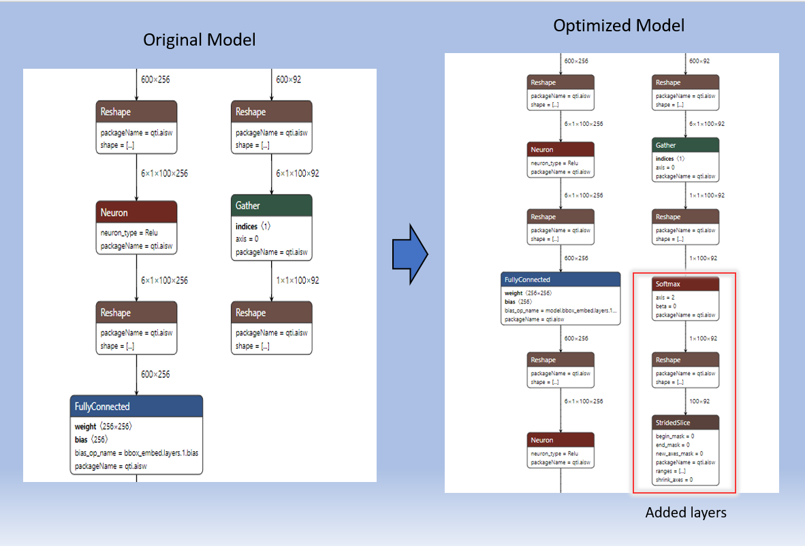

## Object Detection with DETR

The project is designed to utilize the [Qualcomm® Neural Processing SDK for AI ](https://developer.qualcomm.com/sites/default/files/docs/snpe/index.html), a deep learning software from Snapdragon platforms for Object Detection in Android. The Android application can be designed to use any built-in/connected camera to capture the objects and use Machine Learning model to get the prediction/inference and location of the respective objects.

# Pre-requisites

* Before starting the Android application, please follow the instructions for setting up Qualcomm Neural Processing SDK using the link provided. https://developer.qualcomm.com/sites/default/files/docs/snpe/setup.html
* Android device 6.0 and above which uses below mentioned Snapdragon processors/Snapdragon HDK with display can be used to test the application
* Download dataset of your choice and give its path to Generate_DLC.ipynb. Change variable "dataset_path" in Quantization Section in notebook.

## List of Supported Devices

- Snapdragon® 8 Gen 3
- Snapdragon® 8 Gen 2

The above targets supports the application with CPU, GPU and DSP. 
For more information on the supported devices, please follow this link https://developer.qualcomm.com/docs/snpe/overview.html

# Source Overview

## Source Organization

demo : Contains demo GIF

app : Contains source files in standard Android app format

app\src\main\assets : Contains Model binary DLC.

app\src\main\java\com\qc\DETR : Application java source code 

app\src\main\cpp : native source code 
  
sdk: Contains openCV sdk

## DLC Generation

Run jupyter notebook GenerateDLC.ipynb. This notebook will generate DETR quantized dlc, You cann take the notebook from here [DETR_Notebook Link](https://github.qualcomm.com/qualcomm-model-zoo-public-mirror/models-for-solutions/tree/main/03-object-detection/detr_resnet101)

DETR model is has 80 classes of everyday objects.
For model details, please refer to paper : https://arxiv.org/abs/2005.12872

RESNET101 version of DETR is used in this solution. 
	
## Code Implementation

This application opens a camera preview, collects all the frames and converts them to bitmap. The network is built via Neural Network builder by passing detr_resnet101_w8a8.dlc as the input. The bitmap is then given to the model for inference, which returns object prediction and localization of the respective object.

### Prerequisite for Camera Preview.

Permission to obtain camera preview frames is granted in the following file:
```python
/app/src/main/AndroidManifest.xml
<uses-permission android:name="android.permission.CAMERA" />
 ```
In order to use camera2 APIs, add the below feature
```python
<uses-feature android:name="android.hardware.camera2" />
```
### Loading Model

Code snippet for neural network connection and loading model:
```java
snpe = snpeBuilder.setOutputLayers({})
            .setPerformanceProfile(zdl::DlSystem::PerformanceProfile_t::BURST)
            .setExecutionPriorityHint(
                    zdl::DlSystem::ExecutionPriorityHint_t::HIGH)
            .setRuntimeProcessorOrder(runtimeList)
            .setUseUserSuppliedBuffers(useUserSuppliedBuffers)
            .setPlatformConfig(platformConfig)
            .setInitCacheMode(useCaching)
            .setUnconsumedTensorsAsOutputs(true) 
            .build();  //builds the network
```

### Preprocessing

The bitmap image is passed as openCV Mat to native and then converted to BGR Mat of size 320x320x3. Basic image processing depends on the kind of input shape required by the model, then writing that processed image into application buffer.
```java

    cv::Mat img320;

    cv::resize(img,img320,cv::Size(1066,800),cv::INTER_CUBIC);  //TODO get the size from model itself

    float * accumulator = reinterpret_cast<float *> (&dest_buffer[0]);

    //opencv read in BGRA by default
    cvtColor(img320, img320, CV_BGRA2BGR);
    LOGI("num of channels: %d",img320.channels());
    int lim = img320.rows*img320.cols*3;
    for(int idx = 0; idx<lim; idx++)
        accumulator[idx]= img320.data[idx]*0.00392156862745f;

 ```
 
 ## PostProcessing
 
 This included getting the class with highest confidence for each 100*91 boxes and applying argmax to get the detected objects.
 
 ```java
for(int i =0;i<(100);i++)  //TODO change value of 2100 to soft value
    {
        int start = i*91;
        int end = (i+1)*91;

        auto it = max_element (BBout_class.begin()+start, BBout_class.begin()+end);
        int index = distance(BBout_class.begin()+start, it);
        std::string classname = classnamemapping[index];
        if(*it>0.4 )
        {

            int x1 = (BBout_boxcoords[i * 4 + 0]-0.5*BBout_boxcoords[i * 4 + 2])*320;
            int y1 = (BBout_boxcoords[i * 4 + 1]-0.5*BBout_boxcoords[i * 4 + 3])*320;
            int x2 = (BBout_boxcoords[i * 4 + 0]+0.5*BBout_boxcoords[i * 4 + 2])*320;
            int y2 = (BBout_boxcoords[i * 4 + 1]+0.5*BBout_boxcoords[i * 4 + 3])*320;

        LOGI("it %d %d %d %d %s",x1,y1,x2,y2,classname.c_str());


            Boxlist.push_back(BoxCornerEncoding(x1, y1, x2, y2,*it,classname));
        }
    }

    std::vector<BoxCornerEncoding> reslist = NonMaxSuppression(Boxlist,0.20);
```
then we just scale the coords for original image

```java
        float top,bottom,left,right;
        left = reslist[k].y1 * ratio_1;   //y1
        right = reslist[k].y2 * ratio_1;  //y2

        bottom = reslist[k].x1 * ratio_2;  //x1
        top = reslist[k].x2 * ratio_2;   //x2
```

## Drawing bounding boxes

```java
 RectangleBox rbox = boxlist.get(j);
            float y = rbox.left;
            float y1 = rbox.right;
            float x =  rbox.top;
            float x1 = rbox.bottom;

            String fps_textLabel = "FPS: "+String.valueOf(rbox.fps);
            canvas.drawText(fps_textLabel,10,70,mTextColor);

            String processingTimeTextLabel= rbox.processing_time+"ms";

            canvas.drawRect(x1, y, x, y1, mBorderColor);
            canvas.drawText(rbox.label,x1+10, y+40, mTextColor);
            canvas.drawText(processingTimeTextLabel,x1+10, y+90, mTextColor);
```
# Model Optimization 



# Build and run with Android Studio

## Build APK file with Android Studio 

1. Clone QIDK repo. 

2. Run below script, from the directory where it is present, to resolve dependencies of this project.

* This will copy snpe-release.aar file from $SNPE_ROOT to "snpe-release" directory in Android project.

	**NOTE - If you are using SNPE version 2.11 or greater, please change following line in resolveDependencies.sh.**
	```
	From: cp $SNPE_ROOT/android/snpe-release.aar snpe-release
	To : cp $SNPE_ROOT/lib/android/snpe-release.aar snpe-release
	```
* Download opencv and paste to sdk directory, to enable OpenCv for android Java.

```java
	bash resolveDependencies.sh
```

3. Run jupyter notebook GenerateDLC.ipynb to generate DLC(s) for quantized DETR DLC. Also, **change the dataset_path with Coco Dataset Path**.  
* This script generates required dlc(s) and paste them to appropriate location. 


4. Do gradle sync
5. Compile the project. 
6. Output APK file should get generated : app-debug.apk
7. Prepare the Qualcomm Innovators development kit to install the application (Do not run APK on emulator)

8. If Unsigned or Signed DSP runtime is not getting detected, then please check the logcat logs for the FastRPC error. DSP runtime may not get detected due to SE Linux security policy. Please try out following commands to set permissive SE Linux policy.

It is recommended to run below commands.
```java
adb disable-verity
adb reboot
adb root
adb remount
adb shell setenforce 0
```

9. Install and test application : app-debug.apk
```java
adb install -r -t app-debug.apk
```

10. launch the application

Following is the basic "Object Detection" Android App 

1. On first launch of application, user needs to provide camera permissions
2. Camera will open and pose will be seen, if human is visible on the screen 
3. User can select appropriate run-time for model, and observe performance difference

Same results for the application are : 

## Demo of the application

<p align="center">

</p>

# References

1. https://github.com/facebookresearch/detr
2. https://pytorch.org/hub/
	
###### *Snapdragon and Qualcomm Neural Processing SDK are products of Qualcomm Technologies, Inc. and/or its subsidiaries.*
