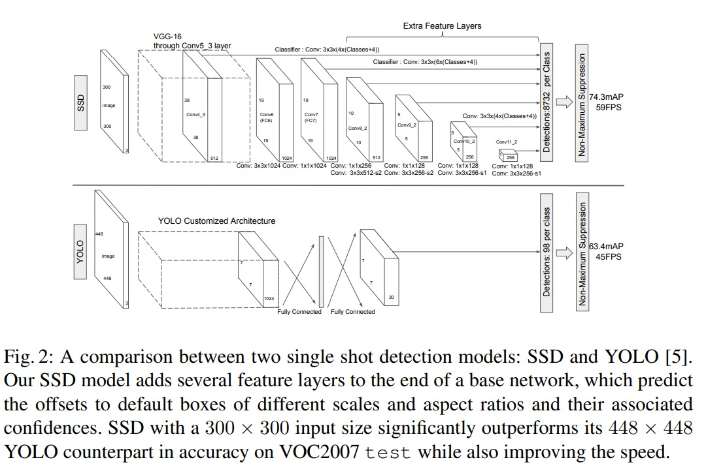

**Note : Caffe to DLC conversion is deprecated in AI SDK from version 2.11. This solution is only applicable, with older SDK versions.**


# Object Detection with MobilenetSSD

The project is designed to utilize the [Qualcomm® Neural Processing SDK for AI ](https://developer.qualcomm.com/sites/default/files/docs/snpe/index.html), a deep learning software from Snapdragon platforms for Object Detection in Android. The Android application can be designed to use any built-in/connected  camera to capture the objects and use Machine Learning model to get the prediction/inference and location of the respective objects.

## Pre-requisites

* Before starting the Android application, please follow the instructions for setting up Qualcomm Neural Processing SDK using the link provided. https://developer.qualcomm.com/sites/default/files/docs/snpe/setup.html
* Android device 6.0 and above which uses below mentioned Snapdragon processors/Snapdragon HDK with display can be used to test the application
* To install caffe follow the instructions from https://qdn-drekartst.qualcomm.com/hardware/qualcomm-innovators-development-kit/frameworks-qualcomm-neural-processing-sdk-for-ai <TODO> 

## List of Supported Devices

- Snapdragon® SM8550

The above targets supports the application with CPU, GPU and DSP. For more information on the supported devices, please follow this link https://developer.qualcomm.com/docs/snpe/overview.html

# Model Architecture, Model conversion 



## How to get the model ? 

For this demo, a caffe version of MobileNetSSD was used. 

```python
wget https://raw.githubusercontent.com/chuanqi305/MobileNet-SSD/master/deploy.prototxt
wget https://github.com/chuanqi305/MobileNet-SSD/raw/master/mobilenet_iter_73000.caffemodel
```
Convert model to DLC 

```python
snpe-caffe-to-dlc --input_network deploy.prototxt --caffe_bin mobilenet_iter_73000.caffemodel --output_path mobile_net.dlc
```
## How to change the model ? 

Object detection models are highly dependant on model architecture, and the pre-processing requirements vary a lot from model to model. 
If user intends to use a different model e.g. YoloV5, following steps should be followed : 

- Ensure Qualcomm® Neural Processing SDK supports the operations in selected model
- Study the pre processing, and post processing requirements for the selected model
- Most object detection models operate in RGB space. Input camera YUV buffers need to be converted to RGB basd on model requirements 

# Source Overview

## Source Organization

demo : Contains demo GIF

doc : Contains documentation/images for current project

app : Contains source files in standard Android app format

app\src\main\assets : Model binary DLC

app\src\main\java\com\qc\objectdetection : Application source code 


## Code Implementation

This application opens a camera preview, collects all the frames and converts them to bitmap. 
The network is built via  Neural Network builder by passing mobilenet.dlc as the input. 
The bitmap is then given to the model for inference, which returns object prediction and localization of the respective object.

The application is customized for detection of bicycle, motorbike, bus, car and person only. 

### Prerequisite for Camera Preview.

Permission to obtain camera preview frames is granted in the following file:
```python
/app/src/main/AndroidManifest.xml
<uses-permission android:name="android.permission.CAMERA" />
 ```
In order to use camera2 APIs, add the below feature
```python
<uses-feature android:name="android.hardware.camera2" />
```
### Loading Model
Code snippet for neural network connection and loading model:
```java
NeuralNetwork network = new SNPE.NeuralNetworkBuilder(application)
    .setRuntimeCheckOption(runtimeCheck)
    .setDebugEnabled(false)
    .setOutputLayers(outputLayerNames)
    .setModel(assetInputStream, assetInputStream.available()) // Loads a model from DLC file
    .setPerformanceProfile(NeuralNetwork.PerformanceProfile.DEFAULT)
    .setRuntimeOrder(selectedRuntime) // Runtime.DSP, Runtime.GPU_FLOAT16, Runtime.GPU, Runtime.CPU
	// Allows selecting a runtime order for the network.
	// In the example below use DSP and fall back, in order, to GPU then CPU
	// depending on whether any of the runtimes are available.
    .setCpuFallbackEnabled(needsCpuFallback)
    .build();// Build the network
```
### Capturing Preview Frames:
Texture view is used to render camera preview. TextureView.SurfaceTextureListener is an interface which can be used to notify when the surface texture associated with this texture view is available.
```java
private final TextureView.SurfaceTextureListener mSurfaceTextureListener
    = new TextureView.SurfaceTextureListener() {

	@Override
	public void onSurfaceTextureAvailable(SurfaceTexture texture, int width, int height) {
	    openCamera(width, height);
	}

	@Override
	public void onSurfaceTextureSizeChanged(SurfaceTexture texture, int width, int height) {
	    configureTransform(width, height);
	}

	@Override
	public boolean onSurfaceTextureDestroyed(SurfaceTexture texture) {
	    return true;
	}

	@Override
	public void onSurfaceTextureUpdated(SurfaceTexture texture) {
	}

};
```
### Camera Callbacks
Camera call back, CameraDevice.StateCallback is used for receiving updates about the state of a camera device. In the below method, we call "createCameraPreviewSession" where surface texture is created to capture the review and obtain the frames.
```java
private final CameraDevice.StateCallback mStateCallback = new CameraDevice.StateCallback() {
        @Override
        public void onOpened(@NonNull CameraDevice cameraDevice) {
            // This method is called when the camera is opened.  We start camera preview here.
            mCameraOpenCloseLock.release();
            mCameraDevice = cameraDevice;
            createCameraPreviewSession();
        }
        @Override
        public void onDisconnected(@NonNull CameraDevice cameraDevice) {
            mCameraOpenCloseLock.release();
            cameraDevice.close();
            mCameraDevice = null;
        }
        @Override
        public void onError(@NonNull CameraDevice cameraDevice, int error) {
            mCameraOpenCloseLock.release();
            cameraDevice.close();
            mCameraDevice = null;
            Activity activity = getActivity();
            if (null != activity) {
                activity.finish();
            }
        }
    };
 ```
### Getting Bitmap from Texture view
Bitmap of fixed height and width can be obtained from TextureView in onCaptureCompleted callback using TotalCaptureResult. That bitmap can be compressed and sent to model as input.
```java
@Override
public void onCaptureCompleted(@NonNull CameraCaptureSession session, @NonNull
	CaptureRequest request, @NonNull TotalCaptureResult result) {
    super.onCaptureCompleted(session, request, result);
		.....
    if (mNetworkLoaded == true) {
	ByteArrayOutputStream mByteArrayOutputStream = new ByteArrayOutputStream();
	Bitmap mBitmap = mTextureView.getBitmap(Constants.BITMAP_WIDTH, Constants.BITMAP_HEIGHT);
	}
}
 ```
### Object Inference
The bitmap image converted to RGBA byte array of size 300x300x3. Basic image processing depends on the kind of input shape required by the model, then converting that processed image into the tensor is required. The prediction API requires a tensor format with type Float which returns object prediction and localization in <code>Map<String, FloatTensor></code> object.
```java
private Map<String, FloatTensor> bitmapInference(Bitmap inputBitmap) {
	final Map<String, FloatTensor> outputs;
	try {
	    // safety check
	    if (mNeuralNetwork == null || tempInputTensor == null || inputBitmap.getWidth() != getInputWidth() || inputBitmap.getHeight() != getInputHeight()) {
		return null;
	    }

	    mBitmapUtility.convertBitmapToBuffer(inputBitmap);
	    final float[] inputFloatsHW3 = mBitmapUtility.bufferToFloatsBGR();
	    if (mBitmapUtility.isBufferBlack())
		return null;
	    tempInputTensor.write(inputFloatsHW3, 0, inputFloatsHW3.length, 0, 0);
	    outputs = mNeuralNetwork.execute(mInputTensorsMap);
	} catch (Exception e) {
	    e.printStackTrace();
	    System.out.println(e.getCause() + "");
	    return null;
	}
	return outputs;
}
 ```
### Object Localization
Model returns the respective Float Tensors, from which the shape of the object and its name can be inferred. Canvas is used to draw a rectangle on the predicted object.
```java
   private void computeCoordinate(RectangleBox rbox, Canvas canvas) {
        float y = getHeight() * rbox.left;
        float y1 = getHeight() * rbox.right;
        float x = getWidth() * rbox.top;
        float x1 = getWidth() * rbox.bottom;

        String textLabel;
        if (rbox.label != null && !rbox.label.isEmpty())
            textLabel = rbox.label;
        else
            textLabel = String.valueOf(rbox.label_index + 2);
        canvas.drawText(textLabel, x + 10, y + 30, mTextColor);
        mBorderColor.setColor(createColor(rbox.label_index));
        canvas.drawRect(x, y, x1, y1, mBorderColor);
    }

```

# Build and run with Android Studio

## Build APK file with Android Studio 

1. Clone QIDK repo. 
2. Generate DLC using the steps mentioned above (object_detect.dlc)
3. Copy "snpe-release.aar" file from android folder in "Qualcomm Neural processing SDK for AI" release from Qualcomm Developer Network into this folder : VisionSolution1-ObjectDetection\app\src\main\libs
4. Copy DLC generated in step-2 at : VisionSolution1-ObjectDetection\app\src\main\assets (object_detect.dlc)
5. Import folder VisionSolution1-ObjectDetection as a project in Android Studio 
6. Compile the project. 
7. Output APK file should get generated : app-debug.apk
8. Prepare the Qualcomm Innovators development kit to install the application (Do not run APK on emulator)

If Unsigned or Signed DSP runtime is not getting detected, then please check the logcat logs for the FastRPC error. DSP runtime may not get detected due to SE Linux security policy. Please try out following commands to set permissive SE Linux policy.
It is recommended to run below commands.
```java
adb disable-verity
adb reboot
adb root
adb remount
adb shell setenforce 0
```

9. Install and test application : app-debug.apk
```java
adb install -r -t app-debug.apk
```

10. launch the application

Following is the basic "Object Detection" Android App 

1. On first launch of application, user needs to provide camera permissions
2. Camera will open and objct detection output can be seen on screen 
3. User can select appropriate run-time for model, and observe performance difference

Same results for the application are : 

## Demo of the application


# References
1. SSD - Single shot Multi box detector - https://arxiv.org/pdf/1512.02325.pdf
2. https://github.com/chuanqi305/MobileNet-SSD

	
###### *Snapdragon and Qualcomm Neural Processing SDK are products of Qualcomm Technologies, Inc. and/or its subsidiaries.*	
