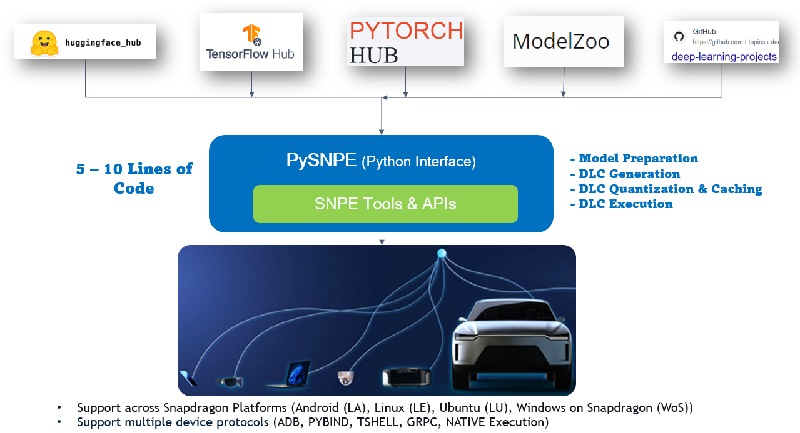
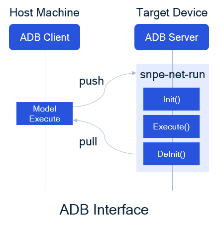
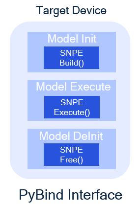
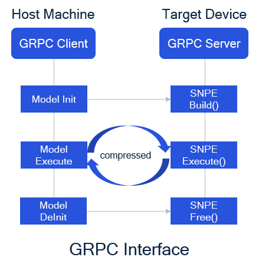

# pysnpe_utils
Python API wrapper over [SNPE](https://developer.qualcomm.com/software/qualcomm-neural-processing-sdk) Tools and APIs for Auto DLC Generation, Quantization, Execution, Easier Integration and On-Device Prototyping of your DNN project.
<br>

#### >> [Tutorials](tutorials/), [How to use](tutorials/README.md) and [Quick Start Guide](tutorials#quick-start)
#### >> [API Documentation in HTML](docs/html/pysnpe_utils/pysnpe.html)
#### >> [API Documentation in Markdown](docs/md/pysnpe_utils/pysnpe.md) (suitable for PDF / Printing / Github README)


## Index:
- [Requirements / Dependencies](#requirements-/-dependencies)
- [How to install this package](#how-to-install-this-package)
- [How to Uninstall](#how-to-uninstall)
- [What's Special](#what's-special)
- [Overview](#overview)
- [Submodules](#submodules)
- [Protocols for Model Prototyping](#protocols-for-model-prototyping)
- [Project INFO](#project-info)

## Requirements / Dependencies:
```
pip install setuptools
```
- <b>(Optional)<b> [Downlaod Graphviz](https://graphviz.gitlab.io/download/) for `Model Visualization` purpose only. For Ubuntu/Debian, please run : 
```
sudo apt install graphviz 
```
- [SNPE SDK](https://developer.qualcomm.com/software/qualcomm-neural-processing-sdk/tools) for the respective Snapdragon platforms and a good Python IDE (like PyCharm/VS-Code/...)

## How to install this package:

A. Fresh Install:
```
git clone https://github.com/quic/qidk.git
cd qidk/Tools/pysnpe_utils && pip install .
```

B. Upgrade / Reinstall existing package, go to `pysnpe_utils` root dir and run:
```
git pull
pip install --upgrade .
```

## How to Uninstall:
```
pip uninstall pysnpe_utils
```

## What's Special:
- Builtin Model conversion with Optimizations for inference
- Auto Model Validation, DLC Conversion and Execution
- Auto Profiling and Quantization from Python interface
- Unified Framework for handling various Snapdgraon Platforms (Android, Linux Ubuntu, Windows on Snapdragon)
- Unified Framework for various [Device Protocols](#protocols-for-model-prototyping) support (ADB, PYBIND, GRPC, TSHELL, NATIVE Execution)
- Supports direct usage and execution on ARM64 platforms
<br>

## Overview:
<p align="center">
  
</p>

The goal of PySnpe is to help users deploy/prototype DNN models from Hub/Git Repo to Snapdragon Devices with a Pythonic Interface, with rich support of [Protocols for Model Prototyping](#protocols-for-model-prototyping).

Please refer to [Introduction](tutorials/README.md) and [Quick Start Guide](tutorials#quick-start) sections for more details.

## Submodules:
- `pysnpe`: For exporting DNN models and SNPE DLC operations
- `pysnpe.modelio`: Built-in end-2-end DNN Pipelines with Pre and Post processing + ADB camera for capturing input from Target device
<br>

## Protocols for Model Prototyping:
PySnpe aims to provide support for various device communication protocols : ADB, PYBIND, GRPC, TSHELL, NATIVE Execution.

1. `ADB Protocol` is supported on Android (LA), Linux Ubuntu (LU) and Linux Embedded (LE) devices.
  - It solely relies on SNPE Tools (like `snpe-net-run`) for execution of model on-device, by pushing-pulling artifacts.
<p align="center">
  
</p>

2. `PYBIND Protocol` is `Python Bindings` for SNPE C++ APIs and is supportd on Snapdragon devices, where python is supported like Windows on Snapdragon(WoS), Linux Ubuntu (LU) and Linux Embedded (LE) devices and has advantages:
  - Provides seamless integration of SNPE APIs with Python interface
  - Zero IO buffer copy
  - Persistent model state (one time model initialization and de-initialization based on model scope)
  - Faster inference cycle compared to any other protocols
<p align="center">
  
</p>

3. `GRPC Protocol` is an alternative to ADB and TSHELL protocol and relies on SNPE C++ APIs. It connects to target device based on IP address and has following advantages:
  - Persistent model state (one time model initialization and de-initialization based on model scope), whereas ADB or TSHELL relies on `snpe-net-run`, for which `INIT -> EXECUTE -> DEINIT` cycle is repeated for each inference
  - Compressed IO bufferes are transferred and received
  - Supports All Snapdragon devices
  - Faster inference cycle compared to ADB or TSHELL
<p align="center">
  
</p>

4. `TSHELL Protocol` is for communicating with Windows on Snapdragon devices, as an alternative to ADB interface

5. `NATIVE Execution Protocol` relies on SNPE Tools for direct execution on Windows on Snapdragon, Windows x86 and Ubuntu x86 host machines. This is the backup option for prototyping, when no Snapdragon target device is available

## Project INFO:

__version__ = "0.1.0" <br>
__author__ = 'Shubham Patel (quic-shubpate) and Pradeep Pant (quic-ppant)' <br>
__credits__ = 'QIDK Solutions, Qualcomm' <br>
