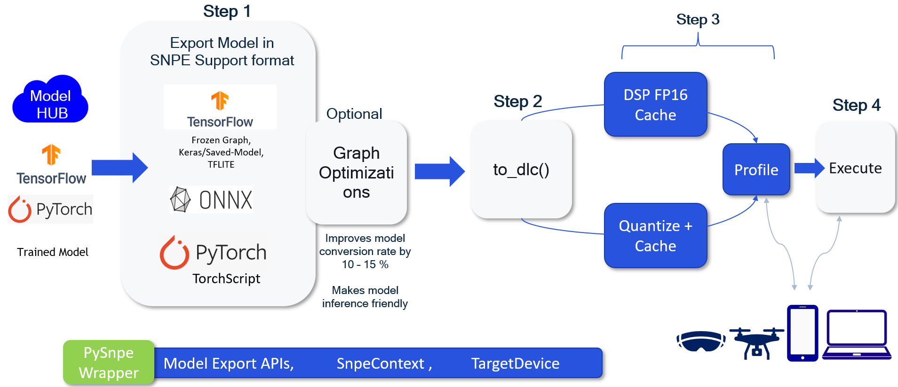

- [Introduction](#introduction)

- [Quick Start](#quick-start)
  1. [Tensorflow Keras Tutorial](#1-tensorflow-keras-tutorial)
  2. [Pytorch ONNX Tutorial](#2-pytorch-onnx-tutorial)
  3. [Tensorflow TF-Lite Tutorial](#3-tensorflow-tf-lite-tutorial)
  4. [Pytorch Torchscript Tutorial](#4-pytorch-torchscript-tutorial)

- [Export API usage](#export-apis-usage)
  1. [export_to_onnx](#1-export_to_onnx)
  2. [export_to_tf_keras_model](#2-export_to_tf_keras_model)
  3. [export_to_tf_frozen_graph](#3-export_to_tf_frozen_graph)
  4. [export_to_tflite](#4-export_to_tflite)
  5. [export_to_torchscript](#5-export_to_torchscript)

- [SnpeContext API usage](#snpecontext-api-usage)
  1. [DLC Generation](#1-dlc-generation)
  2. [DLC Offline Preparation / Caching](#2-dlc-offline-preparation-/-caching)
  3. [DLC Profiling](#3-dlc-profiling)
  4. [DLC Visualization](#4-dlc-visualization)
  5. [DLC Execution](#5-dlc-execution)
  6. [DLC Quantization](#6-dlc-quantization)

- [TargetDevice API usage](#targetdevice-api-usage)
  1. [Creating TargetDevice Instance of different flavors](#1-creating-targetdevice-instance-of-different-flavors)
  2. [Selecting from Multiple devices](#2-selecting-from-multiple-devices)
  3. [Connecting to Device on Remote Machine](#3-connecting-to-device-on-remote-mahcine)
  4. [Setting TargetDevice as Host Machine itself](#4-setting-targetdevice-as-host-machine-itself)


## Introduction
<p align="center">
  
</p>

Deploying DNN model on Snapdragon is a 4 step process with SNPE:
1. Exporting model in SNPE supported format (ONNX, TF Keras-Saved Model/Frozen Graph, TF-Lite, Torchscript)
2. Converting exported model into SNPE DLC (Deep Learning Container)
3. Optional DLC quantization and DSP Offline Graph Preparation (Caching)
4. DLC execution / profiling on Target Device

PySnpe Interface covers the above 4 steps as follows: <br>
A. [Export APIs](#export-apis-usage) is to export the model in SNPE supported format ( `STEP 1` ) <br>
B. [SnpeContext class](#snpecontext-api-usage) is for DLC Generation, Quantization, Caching and Execution ( `STEP 2,3 and 4` ) <br>
C. [TargetDevice class](#targetdevice-api-usage) is to prepare Target device for inference and profiling, needed for `STEP 4`<br>


## Quick Start
### 1. Tensorflow Keras Tutorial
```
# Create TF Keras model instance
model = TFAutoModelForSequenceClassification.from_pretrained("philschmid/tiny-bert-sst2-distilled")

# Run Inference
logits = model(input_encodings.input_ids, input_encodings.attention_mask)

# Post process
logits = tf.nn.softmax(logits[0], axis=-1) * 100

# =============== Deploy with PySnpe ==================
from pysnpe_utils import pysnpe
from pysnpe_utils.pysnpe_enums import *

# Create target device instance for deploying model
target_device = pysnpe.TargetDevice(target_device_adb_id="1c7dec76")

# Create list of InputMap to specify Model Input layers and dimensions, with datatype
input_map = [ InputMap('input_ids', (1,128), tf.int32), 
              InputMap('attention_mask', (1,128), tf.int32) ]

# Export model in TF Saved-Model/Frozen Graph format and 
  # 1. Convert to FP32 DLC using `to_dlc()`
    # 2. Generate DSP FP16 Cache, by mentioning DLC type, using `gen_dsp_graph_cache()`
      # 3. Visualize the generated DLC, using `visualize_dlc()`
snpe_context = pysnpe.export_to_tf_keras_model(model, input_map, "sentiment_analysis_tiny_bert",
                                               frozen_graph_path="sentiment_analysis_tiny_bert_frozen_graph.pb"
                                              ).to_dlc()\
                                                    .gen_dsp_graph_cache(DlcType.FLOAT)\
                                                        .visualize_dlc()
# Prepare Inputs for Inference in Numpy Array format
input_tensor_map = { "input_ids:0": np.array(input_encodings.input_ids, dtype=np.float32), 
                     "attention_mask:0": np.array(input_encodings.attention_mask, dtype=np.float32) }

# Run Inference on target_device
out_tensor_map = snpe_context.execute_dlc(input_tensor_map, DlcType.FLOAT, 
                                            target_acclerator=Runtime.DSP, target_device=target_device)
# Post process the output
logits = tf.nn.softmax(out_tensor_map["Identity:0"], axis=-1) * 100
```

Please refer to full tutorial : [tinyBert_tf_sentimentAnalysis.py](tinyBert_tf_sentimentAnalysis.py)
<br>

### 2. Pytorch ONNX Tutorial
```
# Download/Load MiDas model from Torch Hub
midas = torch.hub.load("intel-isl/MiDaS", "MiDaS_small")
midas.eval()

# Preprocess input img
preprocessed_img = transform(img).to(device)

# Run Inference with PyTorch
with torch.no_grad():
    torch_prediction = midas(preprocessed_img)

# =============== Deploy with PySnpe ==================
from pysnpe_utils import pysnpe
from pysnpe_utils.pysnpe_enums import *

# Create target device instance for deploying model
target_device = pysnpe.TargetDevice(target_device_adb_id="1c7dec76")

# Convert Torch model to ONNX => DLC => Generate Cache (offline preparation) => Profile => Visualize
snpe_context = pysnpe.export_to_onnx(midas, [InputMap('img', (1, 3, 192, 256), torch.float32) ],
                                        ["out_depth"], "midas_v2.onnx")\
                                            .to_dlc().gen_dsp_graph_cache(DlcType.FLOAT)\
                                                .set_target_device(target_device=target_device)\
                                                    .profile(runtime=Runtime.DSP).visualize_dlc()
# Prepare inputs as Numpy Nd-Array for inference
input_tensor_map = {'img' : preprocessed_img.cpu().numpy()}
transpose_order = {'img' : (0,2,3,1)}    # ==> This is needed as SNPE needs input in NHWC (channel last format)

# Run inference
snpe_out = snpe_context.execute_dlc(input_tensor_map, transpose_input_order=transpose_order,
                                    target_acclerator=Runtime.DSP )
# Convert to Torch tensor format
snpe_prediction = torch.from_numpy(snpe_out['out_depth'])
```

Please refer to full tutorial : [midasV2_onnx_monocularDepthEstimation.py](midasV2_onnx_monocularDepthEstimation.py)

For models with multiple Input-Output, please also refer to : [electraSmall_onnx_questionAnswering.py](electraSmall_onnx_questionAnswering.py)

<br>

### 3. Tensorflow TF-Lite Tutorial
```
# Download the model from Tensorflow Hub and set static input shape
IMAGE_WIDTH = 128 ; IMAGE_HEIGHT = 128
keras_layer = hub.KerasLayer('https://tfhub.dev/captain-pool/esrgan-tf2/1')
model = tf.keras.Sequential([keras_layer])
model.build([1, IMAGE_WIDTH, IMAGE_HEIGHT, 3]).summary()

# Load image for inference
input_data = np.expand_dims(image, axis=0).astype(np.float32)

# Run Inference 
prediction = model(input_data)

post_process(prediction, "img_after_sr_with_tf.png")

# =============== Deploy with PySnpe ==================
from pysnpe_utils import pysnpe
from pysnpe_utils.pysnpe_enums import *

# Create target device instance for deploying model
target_device = pysnpe.TargetDevice(target_device_adb_id="1c7dec76")

# Export TF model to TF-Lite => Convert to DLC => Gen. FP16 cache => Profile
snpe_context = pysnpe.export_to_tflite(model, "esrgan.tflite")\
                        .to_dlc().gen_dsp_graph_cache(DlcType.FLOAT)\
                            .set_target_device(target_device=target_device)\
                                .profile(runtime=Runtime.DSP)

# Prepare Inputs for Inference in Numpy Array format
input_tensor_map = { "keras_layer_input": input_data } 

# Run Inference on target_device
out_tensor_map = snpe_context.execute_dlc(input_tensor_map, DlcType.FLOAT, 
                                            target_acclerator=Runtime.DSP)

post_process(out_tensor_map["Identity"], "img_after_sr_with_snpe_dsp.png")
```

Please refer to full tutorial : [esrgan_tflite_imageSuperResolution.py](esrgan_tflite_imageSuperResolution.py)
<br>

### 4. Pytorch Torchscript Tutorial
```
model = torch.hub.load('pytorch/vision:v0.10.0', 'squeezenet1_0', pretrained=True)

input_tensor = preprocess(input_image)

# Run inference
with torch.no_grad():
    output = model(input_batch)

post_process(output)

# =============== Deploy with PySnpe ==================
from pysnpe_utils import pysnpe
from pysnpe_utils.pysnpe_enums import *

# Create target device instance for deploying model
target_device = pysnpe.TargetDevice(target_device_adb_id="1c7dec76")

# Convert Torch model to TorchScript => DLC
pysnpe.export_to_torchscript(model, [(1, 3, 224, 224)], [torch.float32], "squeezenet.pt").to_dlc()

# Get DLC output layer name from Snpe-dlc-info, as output layer name changes & create SnpeConext
snpe_context = pysnpe.SnpeContext("squeezenet.pt", ModelFramework.PYTORCH, 
                                  "squeezenet.dlc", {"x":(1, 3, 224, 224)}, ["reshape_1_0"])\
                                        .gen_dsp_graph_cache(DlcType.FLOAT)\
                                            .set_target_device(target_device=target_device)\
                                                .profile(runtime=Runtime.DSP)

# Prepare inputs as Numpy Nd-Array for inference
input_tensor_map = { 'x' : input_batch.cpu().numpy() }

# Run inference
snpe_out = snpe_context.execute_dlc(input_tensor_map, target_acclerator=Runtime.DSP )

# SNPE predictions
post_process(torch.from_numpy(snpe_out['reshape_1_0']))
```

Please refer to full tutorial : [squeezenet_torch_imagenetClassification.py](squeezenet_torch_imagenetClassification.py)
In next version of PySnpe, the output layer name will be auto-fetched, so you don't have to do it manually.
<br>

## Export APIs Usage
For Exporting trained model to SNPE supported format (ONNX, TF Keras/Saved Model/Frozen Graph, TF-Lite, Torchscript), 5 functional APIs are provided : 
`export_to_onnx`, `export_to_tf_keras_model`, `export_to_tf_frozen_graph`, `export_to_tflite` and `export_to_torchscript`


### 1. export_to_onnx
The `export_to_onnx` function exports it to ONNX format using `torch.onnx.export` API, with a static Input shape and takes 4 inputs:
1. `torch.nn.Module` model instance
2. List of `InputMap`
3. List of `Output layer names`
4. `name/path` for ONNX model to be generated

InputMap is a simple data class to store `layer_name`, its `input_shape` and expected `datatype` for inference.
It is used to specify Input layers of the model.
`layer_name` can be any meaningful name, as per your convinience.

[ InputMap('input_layer1_name', (batch, channel, height, width), torch.dtype),
  InputMap('input_layer2_name', (batch, channel, height, width), torch.dtype), ... ]

Example Usage:
```
input_map = [ InputMap('input_ids', (1,384), torch.long), 
              InputMap('attention_mask', (1,384), torch.long) ]

# Convert Torch model to ONNX
snpe_context = pysnpe.export_to_onnx( model_instance, input_map,
                                      ["start_logits", "end_logits"], "electraSmall_QA.onnx" )
```
where "start_logits", "end_logits" are output layer names (It can be any name, as per convinience)

After exporting model in ONNX format, optimization for inference is done using ONNXSIM package (The static Input shape helps to better optimize model for Inference) and then validation of model is done for functional correctness, by running inference with dummy inputs using ONNX Runtime (ORT).
Now this model is ready for conversion with `snpe-onnx-to-dlc` tool, which is abstracted by SnpeContext `to_dlc()` API and can be used as `snpe_context.to_dlc()`
 

### 2. export_to_tf_keras_model
The `export_to_tf_keras_model` function exports the TF-model/TF-concrete-function to TF Saved Model format and Frozen Graph (.pb) format, with a static Input shape and takes 3 inputs:
1. TF-model/TF-concrete-function
2. List of `InputMap`
3. `name/path` to save generated TF Saved Model and Frozen Graph

InputMap is a simple data class to store `layer_name`, its `input_shape` and expected `datatype` for inference.
It is used to specify Input layers of the model.
`layer_name` can be any meaningful name, as per your convinience.

[ InputMap('input_layer1_name', (batch, channel, height, width), torch.dtype),
  InputMap('input_layer2_name', (batch, channel, height, width), torch.dtype), ... ]

Example Usage:
```
input_map = [ InputMap('input_ids', (1,128), tf.int32), 
              InputMap('attention_mask', (1,128), tf.int32) ]

snpe_context = pysnpe.export_to_tf_keras_model(model, input_map, "sentiment_analysis_tiny_bert",
                                               frozen_graph_path="sentiment_analysis_tiny_bert_frozen_graph.pb"
                                              )
```

The advantage of exporting model into Frozen grpah (.pb) is that it can be visualized using (Netron Viewer)[https://netron.app] and it also helps with debugging any conversion error, so it is recommended format.

While exporting the model as Frozen graph, the  TF graph optimization APIs are used : `optimize_for_inference`, `run_graph_optimizations` to generate efficient Inference graph (The static Input shape helps to better optimize model for Inference).
Now this model is ready for conversion with `snpe-tensorflow-to-dlc` tool, which is abstracted by SnpeContext `to_dlc()` API and can be used as `snpe_context.to_dlc()`


### 3. export_to_tflite
The `export_to_tflite` function exports the TF Keras Model to TFLite format, with a static Input shape and takes only 2 inputs:
1. TF Keras model
2. `name/path` to save generated TFLite model

If the TF model is in Concrete Function or any other TF format, then please use the `export_to_tf_keras_model` and mentioning the postiional argument : `tflite_path`. It will generate a TFLite model along with other formats.

#### Note : When passing the TF-Keras model to this function, it is mandatory to do `model.build()` keras model with static input shapes as shown in following example :

```
keras_layer = hub.KerasLayer('https://tfhub.dev/captain-pool/esrgan-tf2/1')
model = tf.keras.Sequential([keras_layer])
model.build([1, 256, 256, 3])
snpe_context = pysnpe.export_to_tflite(model, "esrgan.tflite")
```

Now this model is ready for conversion with `snpe-tflite-to-dlc` tool, which is abstracted by SnpeContext `to_dlc()` API and can be used as `snpe_context.to_dlc()`


### 4. export_to_torchscript
The `export_to_torchscript` function exports the Pytorch `torch.nn.Module` Model to Torchscript format, with a static Input shape and takes 4 inputs:
1. Pytorch `torch.nn.Module` Model
2. List of Input Shapes/Dimensions
3. List of Input Datatypes in torch.dtype format
4. `name/path` for Torchscript model to be generated

If conversion to Torchscript format fails then try by setting `strict_tracing=False` and `enable_optimizations=False`.

Example Usage:
```
pysnpe.export_to_torchscript(model, [(1, 3, 224, 224)], [torch.float32], "squeezenet.pt")
```

Now this model is ready for conversion with `snpe-pytorch-to-dlc` tool, which is abstracted by SnpeContext `to_dlc()` API and can be used as `snpe_context.to_dlc()`


### 5. export_to_tf_frozen_graph
The `export_to_tf_keras_model` function exports the TF-1.x Session Graph to TF Frozen Graph (.pb) format, with a static Input shape and takes 4 inputs:
1. TF-Session: The TensorFlow Session containing the trained model
2. A dictionary of model input layer names with their dimensions/shapes
3. A list of model output layer names
4. `name/path` to save generated TF Frozen Graph

The Input and Output layer names can also be found by visualizing the TF Session graph using : `visualize_tf_session_graph(...)` API.


## SnpeContext API usage

The SnpeContext class object stores the basic metadata required for Model converison, quantization and execution. This model metadata contains following:
1. Model Path : location of model
2. Model Framework : TF, PYTORCH, ONNX, TF-LITE, ...
3. DLC Path : location of DLC to be generated or already generated 
   Quant DLC Path : location of Quantized DLC to be generated or already generated
4. Input Tensor Map : Model Input layer/tensor names with their dimensions / shapes
5. Output Tensor names : Model output layer/tensor names
6. Quantization Encodings (Optional) : JSON file containing calculated Min-Max weights and activations distribution range
7. Target device : TargetDevice instance on which inference has to be done
8. Remote Session Name : Path where to keep Snpe Libraries and Model assets required for execution

Example Usage:
```
snpe_context = pysnpe.SnpeContext("squeezenet.pt", ModelFramework.PYTORCH, 
                                  "squeezenet.dlc", {"x":(1, 3, 224, 224)}, ["reshape_1_0"])                                     
```

From SnpeContext object, you can generate DLC usign `to_dlc()` API, create DSP cache using `gen_dsp_graph_cache()`, quantize dlc using `quantize()` API, measure Inference time using `profile()` API and execute DLC on TargetDevice using `execute()` API.

Each SnpeContext can refer to a Floating Point DLC and a Quantized DLC.
If there are multiple DLCs or same DLC with multiple Quantization schemes or Mixed Precision DLCs, then it is suggested to create multiple SnpeContexts for each of them.


### 1. DLC Generation
The `to_dlc()` API from SnpeContext class check the Model Framework type (TF, ONNX, PYTORH, ...) and checks the Model Input-Output Layers/Tensors information from SnpeContext object and accordingly invokes SNPE Converter tools : `snpe-tensorflow-to-dlc`, `snpe-onnx-to-dlc`, ... to convert the Model into DLC.


### 2. DLC Offline Preparation / Caching
The `gen_dsp_graph_cache()` API from SnpeContext class `snpe-dlc-graph-prepare` tool to generate Model cache for DSP runtime so that DLC initialization time on DSP runtime should be fast. This cache generation is TargetDevice specific, so user has to provide List of Chipsets name (eg: ["sm8550"]) for which cache has to be generated and appended to the DLC. 
#### Note: After successfully generation of the cache, a new DLC is created with size larger than the input DLC, as the cache blob is appended into it (and can be verified using `visualize()` API). The location of the new DLC will be stored in SnpeContext object.


### 3. DLC Profiling
The `profile()` API takes the `Runtime` enum to calculate Model Inference time on TargetDevice specified in SnpeContext object or TargetDevice mentioned as positional argument to this API (the later will take preference). This API invokes the `snpe-througput-net-run` tool and prints Model Build time in microseconds and Inference per second metrics.
#### Note: User can specify 'Number of threads' and 'Amount of time in seconds' for which model has to be executed to collect profiling metrics.
Example Usage:
```
from pysnpe_utils.pysnpe_enums import Runtime
snpe_context.profile(runtime=Runtime.DSP)
```

### 4. DLC Visualization
The `visualize_dlc()` API generates graphical representation of DLC as a HTML page, by invoking `snpe-dlc-viewer` tool.


### 5. DLC Execution
The `execute_dlc()` takes dictionary of DLC Input layer/tensor names and the corresponding `NUMPY` ND-Array for inference (user has to convert TF/PyTorch tensor to Numpy Array) and runs inference on TargetDevice specified in SnpeContext object or TargetDevice mentioned as positional argument to this API (the later will take preference) by invoking `snpe-net-run` tool. 

It returns a dictionary containing DLC Output layer/tensor names and their corresponding outputs as `NUMPY` ND-Array.

#### Note: The DLC generated from ONNX has shape in `Batch x Height x Width x Channel` (NHWC - Channel last) format as it is the preferred Memory format of SNPE, whereas ONNX model has shape `Batch x Channel x Height x Width` (NCHW - Channel first) tensor Memory format. So its user responsibility to provide input-transpose-order, as mentioned in below example usage.

Example Usage:
```
# SNPE Context from ONNX framework
snpe_context = pysnpe.SnpeContext("midas_v2-opt.onnx", ModelFramework.ONNX, "midas_v2-opt.dlc",
                                        input_map, ["out_depth"], target_device=target_device )\
                                            .to_dlc()\
                                                .gen_dsp_graph_cache(DlcType.FLOAT)\
                                                    .set_target_device(target_device=target_device)\
                                                        .profile(runtime=Runtime.DSP)\
                                                            .visualize_dlc()
# Prepare inputs as Numpy Nd-Array for inference
input_tensor_map = {'img' : preprocessed_img.cpu().numpy()}

# Change Input Tensor format from Channel-First(NCHW) to Channel-Last(NHWC)
transpose_order = {'img' : (0,2,3,1)}    # ==> This is needed only when DLC is generated from ONNX  

# Run inference
snpe_out = snpe_context.execute_dlc(input_tensor_map, transpose_input_order=transpose_order,
                                    target_acclerator=Runtime.DSP )

# Check if received output has proper shape as Original ONNX model, else transpose the order
ic(snpe_out['out_depth'].shape)
```

### 6. DLC Quantization
The `quantize()` API converts Floating Point DLC to Integer Precision DLC by invoking `snpe-dlc-qunat` tool. The Quantization Scheme, Activation and Weight Bitwidth has to be specified by user using `QuantScheme`, `ActBw` and `weight_bw` enums. 
If user wants to override the Activation and Weights encodings Min-Max (scale-offset) values from JSON file mentioned during DLC generation, then `override_quant_params` arguments needs to be True.

In the current version of PySnpe, user is expected to run some inference using `execute_dlc()` API (atleast for 50 iterations). This helps to generate RAW files for quantization.

Example Usage:
```
# run execute_dlc() atleast for some iterations to generate RAW files for quantization
for i in range(num_iters):
    snpe_out = snpe_context.execute_dlc( input_tensor_map )

# Quantize => generate DSP cache => profile
snpe_context = snpe_context.quantize()\
                              .gen_dsp_graph_cache(DlcType.QUANT)\
                                .profile(runtime=Runtime.DSP, dlc_type=DlcType.QUANT)

# Run inference with Quantized DLC
snpe_out = snpe_context.execute_dlc( input_tensor_map, DlcType = DlcType.QUANT, target_acclerator=Runtime.DSP )
```

## TargetDevice API usage
Qualcomm Snapdragon has wide variety of chipsets (Mobile, Compute, XR, Drone, IOT, Cloud, ...) supported by SNPE and also for easier prototyping/validation SDK also supports x86 runtimes and emulators.

TargetDevice class prepares device for inference by pushing SNPE and DLC artifacts and tells SnpeContext where to execute the DLC. 

It auto-queries for connected devices on Host machine and select the first of them. If it doesn't found any then Host device itself is target device with device-protocol set to `NATIVE_BINARY`

### 1. Creating TargetDevice Instance of different flavors
User has to optionally specify the type of device using `DeviceType` enum and according TargetDevice will decide which protocol to use for communication. User can also override the protocol to be used by specifying in `setDeviceProtocol()` API.

Example usage:
```
target_device = pysnpe.TargetDevice(target_device_type=DeviceType.ARM64_ANDROID)
```

### 2. Selecting from Multiple devices
User can specify ID or IP address of device, if host has multiple devices connected.

Example Usage:
```
target_device = pysnpe.TargetDevice(target_device_adb_id="1c7dec76")
```

### 3. Connecting to Device on Remote Machine
If target device is connected on a Remote Machine can specify the device using two ways:
1. For ADB devices : start ADB Daemon (`sudo adb -a nodaemon server start &`) on Remote Host machine and provide IP address of Remote Host machine for ADB client on local machine to connect. 
```
target_device = pysnpe.TargetDevice(device_host="10.206.64.253", 
                                    target_device_adb_id="728b7a92")
```
#### Note version of ADB client and server should match and should be greater than v1.0.39
2. By specifying IP address of target device for other protocols.


### 4. Setting TargetDevice as Host Machine itself
If user have `Windows on Snapdragon` device or no Snapdragon device, then the Host machine itself can act as target device as :
```
target_device = pysnpe.TargetDevice(target_device_type=DeviceType.X86_64_LINUX)
# or for ARM64 Windows
target_device = pysnpe.TargetDevice(target_device_type=DeviceType.ARM64_WINDOWS)
# or for x86 Windows
target_device = pysnpe.TargetDevice(target_device_type=DeviceType.X86_64_WINDOWS)
```


###### *Qualcomm Neural Processing SDK is a product of Qualcomm Technologies, Inc. and/or its subsidiaries.*
